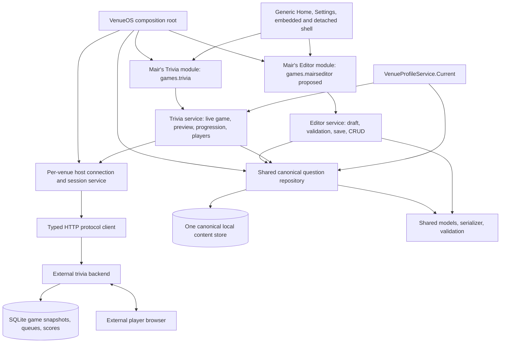

# Mair's Trivia + Mair's Editor VenueOS Reconstruction Audit

## 1. Executive Summary

Audit date: 2026-09-06. This is a source reconstruction audit, not an implementation or a certification of a deployed server. Only this report was created. No donor files, source, configuration, project files, packages, tests, or databases were changed. No builds, restores, migrations, or test suites were run. A read-only JavaScript syntax check was run as described below.

The required product split is feasible: **Mair's Trivia** owns live operation; **Mair's Editor** owns authoring; a VenueOS-owned repository provides their single canonical question library. Neither user-facing module needs to depend on the other being enabled.

The most consequential findings are:

1. **The donor has two authoring UIs**, an in-plugin editor and a separate WPF editor. Both use the shared .NET `.fftrivia` model. The WPF editor edits arbitrary files; importing into the plugin creates a separate plugin-library copy. Do not recreate that independent-copy relationship between the two VenueOS modules.
2. **There is no backend authoring repository or question CRUD API.** Authored plugin content is local `<plugin config>/question-sets/<set UUID>.fftrivia`, indexed by Dalamud configuration. The backend stores uploaded, game-specific JSON snapshots in SQLite. VenueOS currently has neither a local library nor an editor, and accepts sets only as arguments to a service API.
3. **Keep `games.trivia`.** Changing it would orphan saved per-venue configuration and change detached-window identity. Recommend `games.mairseditor` for the new module, with display name `Mair's Editor`; this is a recommendation, not an implemented identity.
4. **The existing VenueOS UI cannot initiate a game.** It provides connection fields and five game-action buttons, but no set picker, import, create-game button, game list/resume, player list, results, or actual host preview. `DrawSettings()` repeats `Draw()`.
5. **VenueOS protocol types are materially incomplete.** Preview returns a question, skip/end return `{ok:true}`, and list-games returns summary records; VenueOS deserializes all of these as full host state. Missing required properties are not validated. Its unused player-choice DTO also uses strings where the server sends `{id,text}` objects.
6. **The backend implements one correct plus three wrong choices per player**, chosen from a stored pool of 3–9 wrong answers (v2; exactly 9 in v1), shuffled independently and persisted. Scores settle at close. First correct is determined by server receipt order, not client clocks; neither host UI has a named first-responder display.
7. **Active games snapshot each attached set.** Reattaching the same source set UUID returns the original game copy, ignoring changed text, answers, version, and ordering. Switching retains queues and scores but has stale-pointer, finished-game, and cross-set question-ID hazards.
8. **The checked-out browser script does not parse.** `node --check server/public/app.js` fails at line 3 on literal backslashes before template-literal delimiters. Browser behavior described below is implemented intent, blocked in this checkout by that syntax defect. No claim is made about the separately deployed site or released ZIP.
9. **Lifecycle and diagnostics need reconstruction.** Donor polling runs from window rendering with uncancelled requests. VenueOS blocks rendering on HTTP, discards normal failure results, lacks polling/session restoration, and has no disable cleanup or stale-response generation guard.
10. **Ten genuine product decisions remain**, listed in §40. Technical correctness, separate modules, shared authority, profile-derived venue identity, and embedded/detached support are already requirements, not open questions.

## 2. Repositories / Files Inspected

### Scope and evidence

| Root | Evidence / starting state |
|---|---|
| `C:\FFXIVplugs\venueos` | HEAD `7fb3b163a7b772afdcc029e341646412d2ab769d`; actual working tree, including untracked implementation, is the audit target. |
| `C:\FFXIVplugs\mairstrivia` | HEAD `6ba4855bd74a173cce8bc9a2987fbe452e6d136f`; `git status --porcelain=v1` was empty. No pre-existing donor modifications were reported. |
| Guide | `C:\FFXIVplugs\venueos\NEW_MODULE_GUIDE.md`, read completely, including all 44 sections, before donor behavioral inspection. |

No applicable `AGENTS.md` was found in the workspace or checked parent locations. VenueOS began with modified `README.md` and untracked `src/`, `tests/`, solution/build metadata, and many architecture/reconstruction documents. These are pre-existing, not audit edits. The initial untracked root files were `ARCHITECTURE.md`, `BACKEND_MODULE_MAINTENANCE.md`, `BINGO_PAYOUT_AUTOMATION_DEFERRED.md`, `Directory.Build.props`, `MAIRS_TRIVIA_3B.md`, `MANUAL_TEST_PLAN.md`, `MODULE_DEVELOPMENT.md`, `NEW_MODULE_GUIDE.md`, `OPERATOR_FEEDBACK.md`, `PARTY_FINDER_PHASE_2D.md`, `PARTY_FINDER_RECONSTRUCTION.md`, `PHASE_2B.md`, `PHASE_2B_PERSISTENCE.md`, `PHASE_2C.md`, `RECONSTRUCTION_ATTENDANCE_GREETER_VIP.md`, `RELEASE.md`, `THEMING.md`, `TOURNAMENT_CONTROL_3C.md`, `UI_REDESIGN_PLAN.md`, `UI_STATUS.md`, `VENUEOS_ARCHITECTURE.md`, `VENUEOS_AUDIT.md`, `VENUEOS_BACKEND_CONTRACTS.md`, `VENUEOS_MIGRATION_PLAN.md`, `VENUE_PROFILES.md`, `VENUE_RAFFLE_3A.md`, `VENUE_BINGO_3D.md`, and `VenueOS.sln`.

All donor executable source in `plugin/`, `shared/`, `editor/`, `server/src/`, and `server/public/` was inspected, along with the schema, all donor test source, documentation, installer, project/package metadata, Render blueprint, and hidden CI/release workflows. The audio asset was identified as a browser notification resource; no audio editing or playback was needed. Dependency lockfiles were inventoried as dependency pins, not treated as authored application logic. Generated build output and third-party dependency source were not behavioral authorities.

VenueOS inspection covered the complete Trivia client/panel/service/wrapper/settings/tests; `Plugin.cs` composition, rendering, transport, and persistence; `Modules.cs`; venue models/store/profile switching; global settings and diagnostics; shared scheduler/chat/presence services; UiKit/Forms/AppFrame/Home/module settings/detached manager/icons; and relevant lifecycle, persistence, service boundaries, UI and test patterns in all eight requested precedent modules. Relevant slices of those unrelated modules were inspected, rather than claiming a full audit of their separate feature sets.

Throughout the report, paths beginning `plugin/`, `editor/`, `shared/`, `server/`, or `schemas/` refer to the **donor** unless explicitly labeled VenueOS. Paths beginning `src/VenueOS...` refer to **VenueOS**. Method names are source locators. Tables §31–32 provide exact file/class mapping. Claims about runtime consequences inferred from source are identified as risks; only the JavaScript parsing failure was independently reproduced. No network endpoint was contacted and no deployment credentials were read.

### Guide versus current source

- Attendance, Greeter, VIP, Party Finder, and ShoutRunner now have distinct settings delegates/surfaces. The guide's broad statement that existing modules mirror `Draw()` is stale; it remains true for Trivia, Raffle, TournamentControl, and Bingo.
- ShoutRunner has its own folder/panel, schema version **2**, and an `IsEnabled` setter that calls `HardStop()`. It is the strongest current disable-cleanup precedent.
- `ModuleHost.DisposeAsync()` reverses dependency order, not simply registration order. Disabled modules skip initialization/venue notifications/Tick; disposal still runs for all.
- Module enable state is a runtime boolean; the shell does not persist the toggle or automatically reload a module on re-enable. A disabled module can miss a venue switch.
- Home still draws disabled tiles dimmed; Settings text saying disabled modules do not appear is inaccurate.
- A schema-version key change produces a missing-key default, not necessarily a recovery warning: `GetModuleConfig` looks up the exact versioned key first. No general migration mechanism exists.
- Shared config stores in `Plugin.cs` now receive the same loaded `VenueOsPluginConfiguration` instance. Preserve that protection against stale full-config overwrites.

## 3. Current VenueOS Mair's Trivia State

| Item | Current implementation |
|---|---|
| Identity | `MairsTriviaModule.Descriptor`: `games.trivia`, `Mair's Trivia`, `Backend-compatible host trivia operations.`, icon `circle-question`, no module dependencies. |
| Registration | `src/VenueOS.Plugin/Plugin.cs` constructs `MairsTriviaClient(new HttpClient { Timeout = 15s })`, `MairsTriviaService(client, venues)`, `MairsTriviaOperatorPanel(service, venues)`, then registers `MairsTriviaModule(service, panel.Draw)`. |
| Service/settings | `src/VenueOS.Modules.Operations/Operations.cs`, `MairsTriviaSettings`, `MairsTriviaDashboard`, `MairsTriviaService`, `MairsTriviaModule` (around lines 665–708). |
| Protocol | `src/VenueOS.Modules.Operations/Trivia/MairsTriviaClient.cs`; typed HTTP results and a WebSocket URI/auth-frame helper, **no running WebSocket client**. |
| Operational UI | Status, Connection, Venue defaults, Game console cards. All fields/actions are also shown in Settings. |
| Editor | None. No file library, parser/import workflow, set metadata UI, question editor, save, delete, reorder, export. The shared-shaped wire DTO alone is not an editor implementation. |
| Creation | Public `CreateGameAsync(TriviaQuestionSet)` exists; no panel caller. Empty-state text tells the user to supply a validated set through the module API. |
| Game controls | `RunActionAsync` handles preview/open/close/skip/end when `CurrentGame != null`; no state-based UI gates or end confirmation. No way in UI to populate `CurrentGame` initially. |
| Credentials | Per-venue URL, username, access token, refresh token, server-access password. Host password is a private panel string, cleared after attempted sign-in; it is not reset explicitly on venue switch. |
| Persistence | Schema 1 payload under `{venue UUID}:games.trivia:1`; `Configure`, login and refresh save settings. Current game and game ID are not persisted. |
| Venue identity | Sends `Settings.VenueName`, falling back to `VenueOS`; does not read active profile display name. Must be reworked under guide §10. |
| Runtime | `CurrentGame`, context CTS, venue ID; derived Dashboard regards nonempty URL/token as configured/authenticated, without health or expiry verification. |
| Lifecycle | Init/Tick no-op; venue change calls `Load`, cancels/replaces CTS and clears current game; dispose calls `Stop` (cancel + clear only). Plain enable flag does not stop work. |
| Errors | Client returns `TriviaResult`; panel ignores failure results. No operational diagnostics injection. `UiKit.SafeDraw` only catches actual thrown UI exceptions. |
| Tests | Six `MairsTriviaClientTests` facts; details in §39. No editor or live workflow coverage. |

Actual UI is a scaffold, not operational feature parity. Health/access validation/profile/list/get/add-set are available in the client but not integrated into the service/operator flow. SelectedQuestionSetId is persisted but unused. The module API lacks select-attached-set, registration, logout, or game-resume orchestration.

## 4. Donor Architecture Summary

```text
WPF MainWindow --save/export--> arbitrary .fftrivia file
                                      |
                               plugin Import (COPY)
                                      v
Dalamud Configuration index <--> QuestionSetLibrary local .fftrivia files
                                      |
                     MainWindow CreateGame / UseSet
                                      v
TriviaApiClient --HTTP--> Fastify routes --> TriviaService --> SQLite
                                             ^               snapshots,
                                             |               queues,
                                  HTTP + player WebSocket    players/scores
                                             |
                                       Browser client
```

`plugin/Plugin.cs` loads config, creates the library directory, constructs `Windows/MainWindow`, wires WindowSystem and `/mairstrivia`. `MainWindow` combines six tabs and all host async orchestration with local authoring. `QuestionSetLibrary` owns plugin files and index writes. `shared/MairsTrivia.QuestionSets` owns mutable models, validation and serialization. The WPF editor has no backend client or credentials.

`server/src/app.ts` binds routes and WebSocket dispatch; `service.ts` owns authentication, game transitions, randomized layouts, scoring, and timers; `db.ts` owns four SQLite migrations. `server/src/index.ts` listens on all interfaces. Browser assets are served by the same Fastify application.

The donor plugin is HTTP-only. Documentation describing host WebSocket subscriptions/commands exceeds implementation: the server authenticates host sockets but sends no host game subscription updates and returns `use_http_commands` to subsequent messages. Player sockets do receive `player.state` updates.

## 5. Complete Capability Inventory

Classification throughout: **A = Mair's Trivia**, **B = Mair's Editor**, **C = Shared**, **D = Remove / do not port**, **E = needs product decision**. A workflow can use C infrastructure while belonging to A or B; this does not imply duplicate ownership.

| Capability family | Actual donor behavior | Classification / disposition |
|---|---|---|
| Host connectivity | Health, server-password check, register, login, saved refresh restore, renewal, profile lookup | A host setup using C transport/session service; registration supported, not a new invention. |
| Local library | Create draft, import copied files, index, search title/description/tags, exact category/tag filters, load, overwrite save, delete | C storage/repository; B maintenance UI; A read-only picker. |
| Set authoring | Title, description, author, version, category/tag lists, explicit draft/validated saves, v1→v2 upgrade | B using C models/validator. |
| Question authoring | Add/select/edit/delete/copy/new UUID, reorder up/down, question text, correct/wrong answers, category/tags | B using C content model. |
| WPF document workflow | New/open/import, save/save-as/export, validate, dirty marker/discard prompt; question/answer search | B adapt behavior; D WPF shell/file association/installer. |
| Game setup | Venue + game label, selected saved set, in-order/shuffle-once, 0–20s timer, cumulative scoring, scoring values | A; C request DTO. Remove duplicated venue field. |
| Live state | Join URL/code, copy link, game state/timer, private question preview, open/skip/close/end | A. |
| Game set management | Upload and select different saved set in same game; reuse original snapshot by source ID | A + C protocol; E exact editing/deletion semantics. |
| Participation | Browser name + token identity, late joins, reconnect, private choices, answer submission, result reveal | A/backend authority; C protocol projections. No Dalamud identity link. |
| Scores | Per-game scores/counts, first-correct bonus, optional server-only second/third bonuses, host-wide cumulative totals | A/backend authority; E policy for exposing extensions. |
| Ordering | Stored source array order; persisted per-game shuffle/queue states; skip consumes question; switch preserves queues | B authored order; A game execution; C models. |
| Timers/realtime | Server auto-close and restart restoration; host 2s HTTP polling and 10m refresh from Draw; player sockets/reconnect | A; C transport. D Draw-driven background scheduling. |
| UI preferences | Misnamed `CompactUi` actually chooses order; browser sound preference persists separately | D field name; A proper ordering default. Browser sound remains external presentation. |
| Distribution | Plugin manifest/release packages, WPF installer, Render blueprint | Reference only; D standalone packaging inside VenueOS. Backend remains external. |

**Absent features:** canonical remote set CRUD; per-question endpoints; set-level duplicate command; set list reorder; archive/enable flag; creator audit timestamps on source files; question notes/time limit; QR generation; question/answer chat collection or announcements; player kick/ban/rename/merge; manual score correction/reset; question replay/repeat/revisit after completion; undo/redo; bulk CSV/Excel import; merge importer; autosave; game deletion/expiry cleanup endpoint; host first-responder details endpoint; host UI game list/resume. Server list/read permits a future resume flow, but the donor does not expose it.

## 6. Proposed Two-Module Functional Split

**Mair's Trivia `Draw()` (A):** select existing validated content through a read-only repository view; prepare game-specific settings; create/list/select/resume host game; show join information, private preview, question state and countdown; state-gated preview/open/close/skip/end; switch attached sets between questions; players, game leaderboard, cumulative leaderboard when enabled; concise busy/error/reconnect state. Any copy-link or future callout is an operational action. A richer first-responder display requires server data not currently returned.

**Mair's Trivia `DrawSettings()` (A/C):** per-venue backend connection, host session/account operations, game-name default, scoring defaults, ordering default, timer/cumulative defaults. A live game's scoring must be displayed separately from defaults: changing a default does not update the server game. No module-local editable Venue Name.

**Mair's Editor `Draw()` (B):** canonical library browse/search; create/rename/metadata; question list, editing, copy/reorder/delete; validation issues; draft and explicit save workflow; schema upgrade; import/export; destructive confirmation; dirty/conflict/active-use indicator. Content stays here even though persistent, following VIP roster precedent.

**Mair's Editor `DrawSettings()` (B):** no invented settings required for parity. A concise “no additional preferences” surface is valid, as VIP demonstrates. If product later chooses author defaults or save preferences, put only those rare defaults here. Do not show trivia account credentials merely to make Settings nonempty: local authoring works offline.

**Shared (C):** file models and schema compatibility, validator, serializer, one repository implementation, immutable read snapshots/revisions, canonical save notifications, transport DTOs and HTTP client, and connection/session ownership if another consumer actually needs it. Source storage is not owned by the Editor enable flag.

**Do not port (D):** donor entry point/command/window system, WPF runtime, installers, hardcoded orange/pink UI, raw ImGui controls, vulgar delete label, unconfirmed persistent deletion, saving settings every frame, polling in Draw, `CancellationToken.None` orchestration, duplicate independent libraries, stale DTO namespace, `CompactUi` naming, contradictory protocol docs, and unused settings as visible controls.

**Identity recommendation:** preserve `games.trivia` and `Mair's Trivia`; recommend new `games.mairseditor` and `Mair's Editor` (description: “Question-set and trivia-content authoring.”). This fits the existing `games.*` group without renaming Trivia to the conceptual `games.mairstrivia`. `circle-question` remains Trivia's glyph. Add a distinct procedural document/pencil glyph (suggested key `file-pen`, not currently registered); do not reuse `circle-question` or add raster branding. Both descriptors should have no dependency on the other. Shared services are constructor dependencies, not user-facing module dependencies. New ID/icon are proposed only.

## 7. Shared Data / Service Architecture

The closest protocol-compatible architecture is a **single VenueOS-owned local canonical question repository**, read by Trivia and edited by Editor. Backend SQLite remains authoritative for live sessions and uploaded snapshots. Calling those snapshots “copies” does not violate the single-authoring-authority requirement: they are immutable execution inputs, never independently editable master libraries.

Recommended components (names are conceptual, not existing classes):

- `QuestionSet` / `TriviaQuestion`, `QuestionSetValidator`, `QuestionSetSerializer`: one VenueOS-owned implementation adapted from donor shared code; no runtime/project reference to the donor.
- `IQuestionSetRepository`: enumerate/filter/read/create/save/delete/import/export; stable IDs; revision/content hash and conflict detection; immutable read results. One implementation and one authority, not one store per module.
- File persistence adapter with atomic replacement and a recoverable index (or transactional local store if selected later). Draft validation and publish/game-readiness validation are distinct operations.
- Editor service holds an unsaved **working draft** plus base revision, not another authoritative library. Trivia holds a selected repository reference and the submitted immutable game snapshot metadata, not a writable content collection.
- HTTP client/session component operates on captured per-venue connection context; question snapshots cross the API only at create/attach. The repository does not need backend authentication for local authoring.

Default recommendation is venue-scoped storage with explicit library access from both modules (§40 D1). Do not put complete question lists in both `games.trivia` and `games.mairseditor` payloads. If filesystem storage is chosen, namespaced venue directories should have stable set UUID filenames. A repository-owned shared index/config key must not be confused with registering a third user module. If global shared content is chosen, use one global content store plus venue references/access policy; do not turn two copies into synchronization jobs.

The composition root owns repository lifetime independently of either module. Shared context activation must not rely solely on enabled-module notifications, because `ModuleHost` skips disabled modules. Resolve/capture venue ID explicitly for every operation and rebind on activation/re-enable; cancel stale work and reject late results. Disabling Editor cancels its own draft operations/subscriptions, not the repository or Trivia's HTTP session.

## 8. Question Model

Exact donor source model: `shared/MairsTrivia.QuestionSets/QuestionSet.cs`, `TriviaQuestion`; wire counterpart `server/src/shared/question-set.ts`.

| JSON / .NET field | Type / default | Rules and owner |
|---|---|---|
| `id` / `Id` | UUID / new GUID | Stable question identity. Copy creates a new GUID. C model; B authors. |
| `question` / `Question` | string / empty | Required nonblank on validation; plugin field limit 4096. |
| `correctAnswer` / `CorrectAnswer` | string / empty | Exactly one; required nonblank; plugin input limit 1024. Not a separate answer entity. |
| `incorrectAnswers` / `IncorrectAnswers` | list of strings / three empty strings | v2 3–9, v1 exactly 9. Each nonblank; all answers distinct after trim + case-insensitive comparison. |
| `category` / `Category` | nullable string / null | Null or nonblank. Plugin blank converts to null; backend requires property to be null or text. |
| `tags` / `Tags` | list of strings / empty | Unique nonblank trimmed/case-insensitive validation; plugin parses comma-separated and deduplicates. |

No per-question ordinal property: list position is author order. No notes, enabled/archived flag, difficulty, image, time limit, weight/points override, creation/update timestamps, creator/editor IDs, or answer IDs are stored in the source question. Runtime choice IDs are generated by the server, unrelated to text or source UUIDs.

The .NET shared validator rejects empty/duplicate question UUIDs within a set, duplicate tags/categories and blank/duplicate answers; **it permits an empty question list**. It is not a complete JSON-schema validator: property initializers can supply missing JSON fields; unknown fields are rejected by the serializer, while explicit null lists can cause runtime exceptions. Server validation checks required values/UUID format and answer uniqueness but does not use Ajv in the HTTP path, does not reject unknown fields, and does not detect duplicate question IDs before the database constraint. Malformed answer types can throw and become generic 500 errors. Schema tests do not prove runtime route validation equivalence.

VenueOS `TriviaQuestionSet.IsValidHostSet()` is weaker for answers/tags/duplicate IDs and stronger for nonempty question count; it only checks answer counts, not blank/distinct wrong answers. It can throw on null collections. `TriviaPlayerQuestion.Choices` is `IReadOnlyList<string>` but actual choices are objects, and its lack of a correct-answer field alone is insufficient protocol coverage.

## 9. Question Set Model

Exact donor source model: `QuestionSet` in the same shared file.

| Field | Type / default | Notes |
|---|---|---|
| `format` | string / `fftrivia-question-set` | Fixed format identifier. |
| `schemaVersion` | int / 2 | Read 1 or 2; explicit upgrade; other versions rejected. |
| `id` | UUID / new GUID | Stable source-set identity; backend deduplication key **within a game**. |
| `title` | string / `Untitled Question Set` | Required. Rename edits this field, not UUID/file identity. |
| `description` | string / empty | Arbitrary description; not required nonblank. |
| `author` | string / `Kei Joi` | Required free text; not authenticated identity. |
| `version` | string / `1.0.0` | Required text; no semantic-version validation or automatic increment. Backend reuse ignores changes. |
| `categories`, `tags` | string lists / empty | Nonblank unique metadata. |
| `questions` | ordered question list / empty | Array order authoritative for `inOrder`. Empty accepted by donor shared/server validation. |

No venue/game owner, timestamp, modified-by, explicit set order, archive/enable field, remote repository ID, or revision exists in source format. Backend `game_question_sets` adds a **different game-set UUID**, `game_id`, `source_set_id`, title, `set_json`, ordering mode, queue JSON and attachment timestamp. Those do not alter canonical source metadata.

| Operation | Existence and semantics |
|---|---|
| Create | Plugin `Create(title)` writes a draft file/index; WPF New creates unsaved document. |
| Edit/rename | Metadata changes in memory, persisted by save. |
| Duplicate set | **No dedicated command.** WPF Save As/Export retains set and question IDs, so it creates a second file, not an independent logical set. |
| Delete | Plugin `Delete(id)` removes all matching index entries then candidate files; no confirmation or active-use check. WPF has no file-delete control. |
| Reorder questions | Both UIs up/down; persisted on save. |
| Reorder sets | **Absent.** Plugin index append order; search preserves it. |
| Select for next game | Plugin library selection sets `selectedSet`/`editingSet`; creating reloads disk. |
| Switch active game set | Separate `Use` action uploads/reuses then selects backend game-set UUID. |
| Import | Plugin copies/overwrites by source UUID; WPF opens file as document. |
| Export | WPF Save As alias; no dedicated plugin export UI. |

## 10. Current Editor Workflow

### In-plugin authoring

1. Open `/mairstrivia` → **Question Sets**. Filter library with Search, Category filter, Tag filter.
2. Type a path and **Import .fftrivia**, or enter New set title and **Create Set**. Import validates full content; create writes metadata-only-valid draft immediately.
3. Select a library row. `SelectSet` replaces the entire working set and selects its first question; no dirty prompt protects the previous draft.
4. Edit Title, Description, Author, Set version, Set categories, Set tags. Fields mutate `editingSet` immediately in memory.
5. **Add Question**, select a question row, enter Question text, Correct answer, Question category/tags, and 3–9 wrong-answer inputs (9 for legacy v1).
6. Add/remove last wrong answer within schema limits. Duplicate Question inserts a deep content copy immediately after the original with a new UUID; Delete Question removes it; Move Up/Down changes author order.
7. **Save Draft** accepts only nonempty title/nonempty set UUID; incomplete questions and other invalid metadata can be saved. **Validate and Save Set** runs shared validation. Issues are also recomputed each draw and only the first three shown inline; game creation shows at most twelve in its error text.
8. Legacy v1 exposes **Upgrade to schema v2 (allow 3–9)**. This changes the in-memory version only until saved.
9. Either set-deletion button deletes persistent content immediately. Both use the same conspicuous legacy label; replace its behavior/presentation under VenueOS confirmation conventions.

Set use and game creation reload saved files; unsaved visible edits do **not** become the game input. Authoring requires no host authentication. Import is not a merge. There is no autosave, undo, global dirty tracking, bulk edit, file picker or dedicated plugin export.

### Standalone WPF authoring

New/Open/Import → metadata → Add/select/Edit question → answers/category/tags → Validate → Save/Save As/Export. Open/Import use `.fftrivia` or `.json` dialogs; save writes `.fftrivia`. New/Open/close ask whether to discard dirty work. Import aliases Open, Export aliases Save As. Save validates the entire set; there is no draft-save variant. Search spans question, correct answer, wrong answers, category and tags; category/tag filters are exact case-insensitive matches. Question duplication/reorder/delete are local document operations. Edit just focuses QuestionBox.

The WPF document is independent of plugin library files unless the operator deliberately opens the exact same file path. Normal documented flow exports then imports a copy. A future unified Editor should adapt these authoring behaviors into its own full workspace, not embed WPF or duplicate the donor tab layout.

## 11. Current Live Trivia Workflow

1. Open plugin Settings; enter backend URL, server password, username, user password. Connect/Login runs health → access validation → login → profile. Create Host Account uses register instead of login. Saved refresh token is restored in MainWindow construction; Reconnect Now retries it.
2. Select a **saved** set in Question Sets. Choose scoring in Scoring. In Game, enter Venue Name and Game Name; choose In Order/Shuffle Once; choose timer 0–20 seconds and cumulative-scoring flag.
3. Create Game checks connection and required names/selection, loads disk, validates, posts full set + options. Backend creates lobby and first snapshot/queue. The plugin stores the returned game only in memory.
4. Share displayed Player URL/Join code with **Copy Link**. No chat transport or QR generation is invoked.
5. Players join via browser, receive backend IDs/tokens. Host `Draw()` polls game every two seconds while window is rendering. Players tab lists scores/counts and optional cumulative totals.
6. Questions → Preview Next changes backend to preview and returns host-only question. UI shows text, correct answer, wrong-answer count; it does not list all wrong answers/category/tags despite documentation claims.
7. Skip consumes only a previewed question, or Send Question opens it. Server generates player layouts and schedules auto-close if timed.
8. Answers are recorded but scores remain unchanged until Close / Results or timer expiry. Results reveal correct text, selected text and awarded points to players; host polls updated totals.
9. Preview again from results for next unused question; or use another set from library. The latter attaches/reuses and selects it, retaining players/scores/progress.
10. Close any open question, then End Game. New joins are refused after finish; reconnect can still retrieve finished state. No automatic end at queue exhaustion, cleanup, or host-game resume UI.

The donor shows “resume” instructions in empty states but has no list/select/resume action. Saving host credentials does not save the current game. VenueOS cannot currently complete steps 2–5 from its UI; its service creation entry point is only a partial starting point.

## 12. Player Identity / Participation Model

`TriviaService.join(joinCode, displayName)` creates a new random player UUID **per join**, associated with a game. Display name is trimmed, required, and limited to 48 input characters; duplicate names are allowed. There is no character-world validation, account linkage, browser account, IP identity policy, player key supplied by Dalamud, or guest-presence subscription.

The server returns an opaque 32-byte-random reconnect credential; only its SHA-256 hash is stored in `players.reconnect_hash`. Browser localStorage key is intended to be `mairs:<joinCode>`. Reconnect looks up that hash, updates `last_seen_at`, returns the same player and stable layout. There is no expiry/revocation UI for player credentials, no disconnect removal, and no presence flag in host state.

Host account UUID and player UUID are distinct domains. `GuestIdentity(Name, HomeWorld)` elsewhere in VenueOS is unrelated and must not silently replace backend display-name/token identity. Cumulative scoring groups lowercase display names across the **host account's cumulative games**, not a verified person or VenueOS profile. Same-name players can be combined; names changed between games split totals. Adding identity linkage would be new product/backend work.

## 13. Answer Distribution / Randomization

Authority: `server/src/service.ts`, `layout`, `shuffle`, `open`, `join`, `playerState`.

- `shuffle([...incorrectAnswers]).slice(0,3)` chooses three wrong answers from the source pool.
- The correct answer is added, all four shuffled, and each gets an opaque random credential-like ID with text. Choices are `{id,text}`, not A/B/C/D codes or source answer indices.
- Layout is generated independently for each player; wrong-answer subsets and order may differ, but differences are **not guaranteed**. A three-wrong pool always gives the same four texts in potentially different order.
- Fisher–Yates uses `Math.random()` without an exposed seed. Choice identifiers use cryptographic random bytes. No deterministic replay seed exists; persistence makes reconnect deterministic.
- Layouts persist in `player_question_layouts` with unique `(player_id,question_id)` and `INSERT OR IGNORE`; reopening/reusing the same question ID cannot replace an old layout. This causes cross-set hazards (§37).
- Late joins during `question_open` get a layout for the active question. A player cannot submit another player's answer ID: membership in their stored choices is checked.
- Normal valid sets prevent duplicate texts through trim/case-insensitive validation; runtime selection itself assumes validated unique content. Browser receives no distinct correct-answer flag while open; results intentionally reveal it after close.

Classification: runtime distribution A/backend; wire shapes and validation C; authoring wrong-answer pools B. Do not move randomized choice generation into Editor or VenueOS host UI.

## 14. Scoring

Authority: `TriviaService.answer` records answers, `closeGame` transaction calls `settleAnswers`, then marks question completed/results.

| Rule | Actual behavior |
|---|---|
| Correct | `correctPoints` plus ranked correct bonus. Server/donor default 100. |
| Incorrect | `incorrectPoints`; default 0; can be negative or positive because scoring values have no meaningful range/type validation at service boundary. |
| First correct | `firstCorrectBonus`; donor/server default 50, VenueOS default **0**. |
| Second/third correct | Optional `secondCorrectBonus` / `thirdCorrectBonus`, default effectively 0; accepted by backend scoring merge, absent donor/VenueOS C# request types and UI. |
| Speed | Receipt-order rank only. `elapsed_ms` stored with wall clock `Date.now()` but unused for point calculation. No continuous speed multiplier. |
| No answer | No answer record: zero points and no correct/incorrect counter increment. Player result reports selectedAnswer null, isCorrect false, pointsAwarded 0. |
| Skip | Only before open, no layout/answer settlement and no score effect. |
| Answer changes | Default false; duplicate rejected. If true, prior record is deleted/replaced, new receipt order determines final rank. Browser still disables after first submission. |
| Award time | Close only. Open-question host scores/counts remain previous totals. |
| Ties | Game leaderboard score descending, then `joined_at`; equal timestamp ties have no explicit final stable key. Cumulative score descending then displayName. No shared-rank or tie-break winner calculation. |
| Persistence | `players.score`, correct/incorrect counts; `player_answers.points_awarded`; game scoring JSON; history. |
| Reset | New game creates new players/totals; no reset/adjust endpoint. Cumulative includes all host-owned cumulative games, even active/finished, with no date/session cutoff or reset. |

Scoring settings are snapshotted at game creation. Changing the plugin Scoring tab or VenueOS defaults mid-game does not change current game scoring. Server allows malformed scoring objects to reach arithmetic/persistence; preserve legitimate policies but strengthen client validation in future. No scoring code belongs in the authoring module.

## 15. First Responder

This is implemented as **first correct retained answer**, not first submission overall. `answer()` reads `MAX(receipt_order)+1` for `(game_id,question_id)` and records server UTC receipt and elapsed time. `settleAnswers()` iterates receipt order, increments `correctRank` only for correct answers, and adds the first bonus at rank one.

Concurrency: HTTP answer handling and better-sqlite3 operations are synchronous in one Node process, with insertion in a DB transaction. The receipt-order calculation is outside that transaction and has no unique constraint; it is not a multi-process ordering guarantee. Render config specifies one instance. No client timestamp affects rank. Exact simultaneous arrival is resolved by server execution order; under answer changes, the replacement receipt takes precedence.

UI: donor Questions contains explanatory text that backend decides first correct; neither `HostGameState` DTO nor host-state JSON includes first-responder identity, receipt-order details, or per-question answer roster. No named first-responder panel exists. Scores can reflect the bonus, but inferring a person from total score is not reliable. A future named display requires an explicit backend projection/read endpoint or protocol extension, not a local calculation.

Duplicate submissions are `answer_locked` by default. If changes are allowed, replacing the prior record changes rank; browser cannot intentionally use this capability. Product policy for ranked bonuses/answer changes is D8 in §40.

## 16. Question Ordering / Progression

Author order is the source `questions` array (B). At create/first attach, backend optionally shuffles once, stores `queue_json`, and creates `game_question_state` with ordinal and `unused` state (A). Progress queries the state rows ordered by ordinal; it does not continually reread local files or reshuffle.

| From | Operation | To / effect | Constraints |
|---|---|---|---|
| No game | create | `lobby`; first snapshot/queue | Required names; valid set; timer integer 0–20. |
| `lobby` / `results` | preview | `preview`; reuse any previewed row else first unused | No active set → `no_question_set`; exhausted → `no_questions`. Returns question, not game state. |
| `preview` | skip | `lobby`, active question null; row `skipped`, history | Only preview can skip. |
| `preview` | open | `question_open`; row `asked`; layouts, timer, history | Must have active question. |
| `question_open` | close / timer | `results`; row `completed`; settle scores/history | Duplicate close gets invalid_state/no further settlement in normal flow. |
| Any except `question_open` | select attached set | `lobby`; active set changed | **Active question pointer not cleared.** Even `finished` accepted. |
| Any except `question_open` | end | `finished`, ended timestamp/history | Can end lobby/preview/results; repeated end not guarded. |

Per-question states are `unused → previewed → asked → completed`, or `previewed → skipped`. Selecting away from a preview leaves its previewed row, allowing return/resume. No direct question-number selection, repeat, rollback, unskip, or restart queue. A completed question remains consumed. Attaching an already-used set retains its old queue and ordering even if a different mode is requested. Backend restart restores DB state and schedules timers for open questions. Host plugin restart loses the current-game selection, despite backend persistence.

## 17. Mid-Game Set Switching

Supported in donor: Question Sets row **Use** → `UseSet(id)` → local disk load → POST attach (`questionSet`, `orderingMode`) → POST select using returned `gameSetId` → replace local selected/editing set and clear preview.

The game ID, join code, venue/game names, host owner, players, scores, stats, history, scoring and timer/cumulative rules stay the same. Existing set progress stays stored; there is no single numeric cursor to reset. New set begins with unused rows; existing set resumes previewed/unused rows. `selectSet` always changes game state to lobby.

Not fully safe:

- UI offers Use whenever `game != null`, even while open; attach may succeed before select rejects with `question_open`, leaving an attached but unselected set.
- Selection leaves `active_question_id` unchanged, so returned state can describe the new set with the old question ID/deadline. Lobby browser hides it, but it remains an inconsistent host state until a later preview updates it.
- Finished games can be returned to lobby by selecting a set; `ended_at` remains set. There is no finished-state guard.
- Same source UUID reuses original snapshot and queue; unsaved or newly saved edits are ignored for that game's existing attachment.
- Different sets sharing question UUIDs collide in layouts/answers keyed without game-set ID. This can reuse old choices, lock answers, and resettle prior answers (§37).

VenueOS has only AddQuestionSetAsync, not the select endpoint or UI/service workflow. Preserve switching intent, but its safe implementation must include state guards and clear snapshot semantics. That technical correction does not require asking whether separate module IDs should exist.

## 18. Backend / API Analysis

The complete endpoint matrix is §36, derived from `server/src/app.ts` and actual service returns, not stale `docs/protocol.md`. Host resource ownership is server account-based. No venue UUID is transmitted. Protocol is camelCase JSON under `/v1`, with public `/health` and static player assets outside it.

**There are no reusable authoring-set GET/POST/PUT/PATCH/DELETE endpoints.** `/games/:gameId/question-sets` uploads a full execution snapshot attached to a game. It is A live workflow over C transport, not Editor CRUD. A cloud/shared-server authoring library would require a new backend contract and separately authorized work.

Transport behavior:

| Layer | Timeout/retry/errors |
|---|---|
| Donor `TriviaApiClient` | Owned HttpClient, 15s timeout; constructs request/headers/body; Web JSON; no automatic retry or refresh-on-401; non-2xx throws with HTTP status **and raw response body**. All current callers pass CancellationToken.None. |
| Donor host orchestration | Refresh token on startup and every 10m from Draw while accessToken exists; game GET every 2s from Draw. Session guard prevents overlapping refresh; game GET has no in-flight guard. Refresh failure clears access token, defeating Draw's automatic retry condition. |
| VenueOS client | Injected HttpClient, 15s at composition; serializes request and rejects >1,048,576 bytes; no retry; expected cancellation returns `cancelled`; all other thrown failures, including malformed JSON/timeouts, collapse to `connection_failed`; non-2xx error DTO parsed with status fallback. |
| Server HTTP | Fastify 1 MiB body limit; ServiceError maps status/code/message; other errors logged and return 500 `internal_error`. Handler does not specially preserve framework 400/413 errors. No explicit app-level timeout/retry policy. SQLite busy timeout 5000ms. |
| Browser HTTP | fetch POST, JSON response, error.message alert; no explicit timeout/abort/backoff. Initial reconnect failure removes token even for network outages. |
| Browser WS | protocol 1; reconnect 2s after close, no backoff/maximum or heartbeat policy in app. Server host authentication acknowledgement only; player event updates. |

Critical VenueOS mismatches: `GameActionAsync<TriviaHostGameState>` treats preview question and skip/end acknowledgements as host states. Default System.Text.Json deserialization can create default/null-filled objects rather than reject missing fields; preview's ID can become CurrentGame.Id (a question UUID), and acknowledgements can set it to Guid.Empty. Subsequent actions can target the wrong game. This consequence is a source-derived risk, not an executed HTTP test. `GetGamesAsync` similarly loses summary timestamps and fills absent host-state fields. `ValidateAccessAsync<object>` discards `{valid:false}` entirely. Donor Authenticate also ignores that boolean before login, though login independently validates server access.

## 19. Authentication / Secrets

No secret values are reproduced here, including development/test fixture values.

| Field | Storage / use | Future scope / class |
|---|---|---|
| Backend URL | Donor config; VenueOS per-venue Connection.BaseUrl; HTTP base. | Per-venue host connection C, edited Trivia settings. Validate HTTP(S), normalize safely, clear incompatible session on change. |
| Username | Donor config; VenueOS connection; server users table. | Per-venue connection C; not a secret token, but do not gratuitously log personal data. |
| Host password | Donor MainWindow.userPassword memory; VenueOS panel password memory; server Argon2id hash in users. | Input only; do not persist plaintext. Donor backend allows empty password; VenueOS UI currently refuses whitespace/empty, a compatibility gap. |
| Server-access password | Donor MainWindow.serverPassword memory only; VenueOS currently persists it; server environment in memory. Header `X-Server-Access-Password` for login/register/access validate. | Per-venue C host connection; persistence is already current VenueOS policy/guide precedent. Not an admin privilege or account identity. |
| Access token | Donor memory; VenueOS saved per venue. Server custom signed payload with host subject/session ID/expiry; 15m lifetime. | C session state, preferably runtime access + persisted refresh; any persistence change requires explicit migration handling. |
| Refresh token | Donor config and VenueOS per-venue config; server stores SHA-256 hash, 30-day fixed session expiry, rotates token on refresh. | C per-venue session; one refresh owner/single-flight to avoid rotation races. |
| Server TOKEN_SECRET | Environment, HMAC signing; code contains development fallback, redacted. | Server-only; never a VenueOS module setting. |
| Player reconnect token | Browser localStorage; server hash in players; player HTTP/WS authentication. | Browser/server only. No Trivia/Editor credential field. |
| Join code / game ID / game-set ID | Server identifiers returned to host; join code is public participation entry, not host auth. | A runtime/session references. |
| Admin key, room key, user/organizer key | **None in trivia protocol.** Those belong to other VenueOS backends. | D: do not invent or copy from Bingo/Tournament. |

`DiagnosticsService.Redact` recognizes `token=`, `accessToken`, `refreshToken`, `AdminKey`, `RoomKey`, `password` case-insensitively and truncates from the first matching marker. It does not reliably recognize a bare Authorization bearer, `reconnectToken`, `tokenSecret`, or arbitrary URL credential. `WithoutSecrets()` strips access/refresh/server password from a record but is not wired to a Trivia diagnostic flow. Operational results can include arbitrary backend error text. Future diagnostics should log stable operation/error codes plus sanitized context, never headers/bodies/source answers by default. Correct-answer content is not an authentication secret, but it is private host data until reveal.

Server authentication limitations from source: `parseAccess` can throw a non-ServiceError on a malformed signature length/JSON; logout extracts session ID without signature authentication and revokes it if present; registration catches hash/insert failures broadly as username_taken; no account password policy is enforced. These are backend findings, not authorization to change the donor. Local Editor requires none of these credentials; a shared repository is not a reason to force login.

## 20. Venue / Game Identity

Donor source content has no venue association. Donor MainWindow stores Venue Name and Game Name only in runtime fields, sends trimmed required strings at creation; backend persists them with host owner and game UUID. Player URL is generated from server `publicBaseUrl` plus `/play/<joinCode>`, not from the plugin's configured URL. A reverse-proxy/public URL mismatch therefore affects links independently of API connectivity.

VenueOS already owns venue GUID/display name in `VenueProfileService.Current`. `MairsTriviaSettings.VenueName` duplicates that authority and currently defaults to empty; service fallback `VenueOS` is also not the active venue. Recommend removing its editable surface and deriving create requests from captured active profile DisplayName, while preserving old payloads during any later schema migration. Existing games retain their server-stored venue label; renaming a profile does not rewrite those games because no rename-game endpoint exists.

Game Name remains module/game-specific. DefaultGameName is persistent; actual game label should be visible/editable before creation in the operational flow. Local venue scope does not impose backend ownership: one host account can own games labeled for several venues, and GET games returns all that host's games. Resume UX must make this distinction explicit without inventing a backend venue filter.

## 21. Chat / Dalamud Integration

Donor registers only `/mairstrivia`, toggling the main window; OpenMainUi/OpenConfigUi also toggle it. There is no `IChatGui`, chat parsing, incoming answer collection, outgoing `/shout`, `/yell`, `/say`, `/tell`, command transport, ECommons dependency, player-object scanning, or FFXIV packet interaction in trivia source. Copy Link sets the clipboard only. HTTP client is backend transport, not game networking.

VenueOS registers `/venueos`; current Trivia adds no command and uses neither ChatCommandService nor PresenceService. If a later approved feature announces links/questions in-game, route it through shared `ChatCommandService` and its framework dispatch, not a direct ProcessCommand call. Actual VenueOS transport prefers ECommons `Chat.ExecuteCommand` then unsafe `RaptureShellModule.ExecuteCommandInner`; that boundary already lives in Plugin.cs. No trivia-specific unsafe engine is needed for the audited functionality. Keep donor command/window entry point out of both module implementations.

## 22. Player-Facing Web Experience

Routes: `/play/:joinCode` serves index.html; static `/index.html`, `/app.js`, `/app.css`, `/question-notification.mp3` are supplied by static hosting (root index can render without a useful code). Browser extracts final path component rather than offering a join-code entry field. Participation requires a name, not a host login.

Intended rendering: Join trivia/display-name form → venue/game heading and own score → wait for host → four answer buttons, timer if enabled → selection disabled optimistically after click → submitted/waiting → result (question, own answer/no answer, correct answer, correctness, points) → finished thanks message. No browser leaderboard, QR, host controls, question authoring, or world/account lookup. Sound toggle is shown once joined, defaults on, persists at `mairs:notification-sound`; a new open-question transition plays the MP3 except initial state restoration. Autoplay failure is ignored.

`refresh()` restores token via POST reconnect; `connect()` opens WS and sends protocolVersion/reconnectToken. Server sends authenticated player state, then `player.state` for changes. Countdown repaints its span every 250ms without rebuilding all controls. Its wall-clock display is not scoring authority. The backend accepts answers based on current state, not an independent deadline comparison in `answer()`; delayed server timer processing can extend acceptance beyond displayed zero.

**Blocking checkout defect:** the file contains literal `\`` and `\${...}` in template-literal expressions outside strings. `node --check server/public/app.js` (available Node v25.1.0, not the donor's declared Node 24 environment) reports `SyntaxError: Invalid or unexpected token` at line 3. This is basic JS syntax and is not a Node-version-specific behavior. The check reads only and does not execute the app. Consequently the checked-in script cannot render the above flow. Existing server tests and TypeScript `include: [src, tests]` do not parse `public/app.js`.

Additional source risks after that syntax issue is addressed: network failure during initial reconnect deletes a valid token; failed answer callback assumes `state.question` still exists after possible pushed results; socket error messages without game data are ignored; invalid credentials can cause a fixed two-second reconnect loop; no reconnect/offline badge or fetch timeout. No changes were made.

## 23. Import / Export

Format is UTF-8 JSON, `.fftrivia`, schema 1/2. File serializer uses explicit camelCase/indented output and disallows unknown members; malformed/unknown JSON becomes `QuestionSetFormatException("The file is not valid JSON.")`. Serialization itself does not validate; caller chooses full validation or draft validation. Source IDs and question order round-trip unchanged.

| Surface | Read/write / duplicate behavior | Validation and failure |
|---|---|---|
| Plugin Import .fftrivia | Reads typed path regardless extension; copies to library `<UUID>.fftrivia`; upserts index by UUID. Same ID overwrites canonical plugin file, no prompt/version comparison/merge. | Full shared validator; status text on failure. Writes file then config; not atomic across layers. |
| Plugin Save Draft | Same file path/index; no independent draft file or publish state. | Only title and set UUID required. |
| Plugin Validate and Save Set | Replaces existing file and metadata index. | Full shared validation; no atomic replace/backup. |
| WPF Open / Import | Same operation; opens `.fftrivia` or `.json` in place, replaces current document after validation. | Dirty discard prompt; all validation issues in error dialog. |
| WPF Save | Writes current path, or invokes Save As if none. | Full validation, warning dialog on issues; filesystem write exceptions are not caught by SaveTo. |
| WPF Save As / Export | Same operation; chooses new path, retains all IDs, updates current document path. | Full validation. No merge or logical set duplication. |

There is no CSV, spreadsheet, zipped collection, clipboard JSON, backend import/export, schema discovery, migration of user data between modules, or plugin export button. Import/export belongs in B using C serializer/repository. Existing format capability should be preserved; it is not itself an unresolved “should we support it” decision. Collision policy and true duplication semantics do require product choices (§40).

## 24. Persistence / Data Ownership

| Layer | Durable content and authority |
|---|---|
| Donor Dalamud config | Version, URL, username, refresh credential, misnamed ordering bool, scoring defaults, metadata index. Global to standalone plugin installation, no venue profiles. |
| Donor plugin local files | Canonical content for its library: question sets/answers/order/metadata. Index is navigation metadata, not a complete content backup. |
| WPF arbitrary files | Canonical documents for WPF editing; plugin import normally makes an independent copy. No WPF settings store. |
| Backend SQLite | users/sessions, games, game-set snapshots/queues/question status, skipped history, players, private layouts, received answers/settled points, event history, migrations. Authority for games only. |
| Browser localStorage | Reconnect token per join code; sound preference across games for that browser origin. No canonical questions or scores. |
| VenueOS Dalamud config | State: venue profiles/themes/module payload JSON; Global: AutoPopOutModules. Trivia connection/defaults under games.trivia/schema1. No Trivia question data or active-game persistence today. |
| VenueOS attendance.db | Existing Attendance/Greeter durable services; not a trivia store. Its existence is precedent for a service-owned DB boundary, not permission to place question data in attendance tables. |
| Render disk | Blueprint mounts `/var/data`, DB `/var/data/trivia.sqlite`, one instance. This is source deployment configuration, not verification of hosted service state. |

Server tables/fields are fully mapped in §25 and §35. SQLite uses WAL, foreign keys, busy timeout 5s; migrations tracked in `schema_migrations(version,applied_at)` and applied transactionally at startup with foreign-key enforcement temporarily disabled. Four migrations create schema, introduce 0–15 timer, cumulative flag, then rebuild games for 0–20 timer. No cleanup scheduler, delete-game API, snapshot-to-library recovery endpoint or browser-side authoritative database exists.

`loadConfig` defaults database path to resolved `data/trivia.sqlite`; `.env.example` uses `./data/mairs-trivia.db`, matching older setup text instead. Start script is `tsx src/index.ts`; no explicit dotenv load appears, so merely copying `.env.example` is not evidence those values are loaded. Server development fallback credentials are present in source but redacted here.

## 25. Runtime State

“Runtime in the client” is distinguished from “persisted authoritative game state on the server.” A game object in memory does not make its backend data ephemeral.

| Owner / field group | Current lifetime | Future owner |
|---|---|---|
| Donor MainWindow serverPassword/userPassword/status | Memory until window/plugin disposal; passwords not cleared after auth | C connection entry; A concise operation status; clear secret inputs on context change. |
| venue, gameName, questionTimeLimitSeconds, cumulativeScoring | Memory setup values, sent into persistent game | A preparation state/defaults. |
| api, accessToken, refreshingSession, nextSessionRefreshUtc | Memory transport/session; refresh token separately persisted | C session component, driven outside Draw. |
| game, nextGameRefreshUtc | Memory host state/next poll | A live service; backend is authority. |
| previewQuestion | Memory host-only full source question | A preview result bound to game/context and active snapshot. |
| selectedSet, selectedQuestion, editingSet | Coupled memory selection/draft; selectedSet also used for create | Separate A selected repository ID and B document selection/draft over C repository. |
| search/category/tag/importPath/newSetTitle | Memory editor filters/input | B; A can have its own harmless read-only picker filter. |
| selected tab / WindowSystem open state | ImGui/window memory | Module shell rendering only, no logic scheduling. |
| WPF _set/_selected/_path/_dirty and text boxes | Memory document, selection, path, dirty state | B draft + revision + validation; path handled by C adapter. |
| VenueOS Settings/contextCancellation/venueId | Loaded settings copy; CTS and venue binding | A settings + C connection/repository context. |
| VenueOS CurrentGame/Dashboard | Memory snapshot/derived flags, no polling | A; use validated authoritative state and real connection status. |
| VenueOS panel password | Memory, survives ordinary close/venue switch until sign-in | A setup input; clear on venue change/disable/disposal. |
| Backend questionTimers/EventEmitter/socket auth/gameId/playerToken | Process memory; timers reconstructed from DB open questions | A backend/runtime infrastructure. |
| Browser token/state/socket/reconnectTimer/countdownTimer/stateInitialized | Memory plus token localStorage | External A participation. |

Backend persistent “runtime” fields:

- `games`: id, owner_user_id, join_code, venue_name, game_name, state, scoring_json, active_set_id, active_question_id, created_at, updated_at, ended_at, question_time_limit_seconds, cumulative_scoring.
- `game_question_sets`: id, game_id, source_set_id, title, set_json, ordering_mode, queue_json, created_at.
- `game_question_state`: id, game_set_id, question_id, state, ordinal, previewed_at, asked_at, completed_at. There is no separate integer current-question cursor.
- `players`: id, game_id, display_name, reconnect_hash, score, correct_count, incorrect_count, joined_at, last_seen_at.
- `player_question_layouts`: id, player_id, game_id, question_id, choices_json, correct_answer_id, created_at.
- `player_answers`: id, player_id, game_id, question_id, answer_id, is_correct, receipt_order, received_at, elapsed_ms, points_awarded.
- `skipped_questions`: id, game_id, game_set_id, question_id, skipped_at.
- `game_history`: id, game_id, event_type, payload_json, created_at. Events written: game.created, questionSet.added, questionSet.selected, question.skipped, question.opened, question.closed (host/timer reason), game.ended. Preview/join/answer have table records/state but no corresponding history event insert.
- Auth: users(id,username,password_hash,created_at); sessions(id,user_id,refresh_hash,expires_at,revoked_at,created_at).

First responder has no separate persisted field; it is derived during settlement from ordered answer rows. There is no active player removal timer or game-expiry timer.

## 26. Lifecycle / Cancellation

**Donor load:** Dalamud config → library constructor creates directory → MainWindow constructor starts saved-session restore → WindowSystem → command/UI event subscriptions. No game is initialized/restored at load. Authenticate constructs/replaces client. Closing window hides UI but does not dispose client or end game. Hidden UI means no Draw-triggered polling or renewal; backend game/timer continues.

**Donor dispose:** remove Draw/OpenMain/OpenConfig/command hooks, remove windows, dispose HTTP client. No explicit CTS, poll cancellation, task join, or server game end/logout. In-flight async methods use None and can still assign state after replacement/disposal. Concurrent login/restore can dispose the shared client beneath another action. Refresh has a bool gate, other requests do not.

**Server:** load config/open DB/apply migrations → TriviaService schedules any persisted open timed questions → routes/sockets → listen. Socket close removes its EventEmitter listener. Fastify onClose closes DB but does not cancel all questionTimers; pending timer callback can attempt access after DB close. Timer uses `unref`, not service-owned disposal. No automatic game cleanup.

**VenueOS:** composition creates shared services, per-backend clients/services/panels, registers modules; ModuleHost initializes enabled modules; profiles Initialize notifies venue; UI/framework event hooks and `/venueos`. Settings toggle modifies bool only. Venue switching persists destination before module notifications; failures are isolated. Detached close is UI-only. Trivia Load cancels old CTS and clears game; Stop cancels current CTS and clears game without disposing CTS/HttpClient. Plain IsEnabled neither invokes Stop nor catches up on re-enable.

Recommendations: independent shared repository lifetime; module-owned cancellable operations; single-flight refresh/poll/action; immutable context capture `(venueId, connection revision, generation, gameId)` and post-await generation checks; nonblocking UI with completion applied on a controlled thread; scheduler/Tick-driven polling; bounded cancel/dispose; re-enable always bind current venue before read/write; never let disabling Editor tear down Trivia. Do not automatically end a backend game merely because its window closes. Exact behavior on module disable/plugin unload/venue switch is product decision D10, but preventing stale cross-venue effects is mandatory.

## 27. Error Handling

| Scenario | Donor behavior / what operator sees | VenueOS now | Future Diagnostics |
|---|---|---|---|
| Backend unavailable / timeout | 15s exception → status string (Settings/Question Sets); old game/preview can remain. | Generic failed result ignored by panel. | Yes, sanitized operation/module/code; concise visible retry state. |
| Bad server credential | access validate returns valid:false; login/register independently 401 invalid_server_access. | validation boolean discarded; failed sign-in invisible. | Yes, no supplied credential in logs. |
| Bad host credentials | 401 invalid_login; donor raw response status. | Client DTO error ignored; token-presence badge may remain stale. | Yes; actionable sign-in state. |
| Expired/revoked host token | 401 expired_token/revoked_token; donor automatic refresh attempted via Draw; refresh failure clears access. | Manual refresh only; no expiry interpretation. | Yes, classify auth versus transport. |
| Malformed response | JSON deserialization exception caught in donor methods. | connection_failed or default-filled DTO; missing-field shape not validated. | Yes, protocol mismatch with operation name. |
| Missing/deleted local set/file | Single/IO/format error in load/create/use; status text. | No repository or selection path. | Yes for IO/corruption; normal not-found can be inline. |
| Invalid set/question | Shared issues (3 inline/12 at create); server invalid_question_set or unhandled malformed types/duplicate DB constraint. | Weak IsValidHostSet check then server result ignored. | Validation inline; unexpected contract/IO failure in Diagnostics. |
| Game not found/other owner | 404 game_not_found; donor status, retains selected old object. | Failure result ignored. | Yes, clear/reconcile inaccessible selection. |
| Game already active | No one-active-game limit; Create Game can start another and replace local game reference. | API similarly permits creation. | Not inherently an error; decide safe UX, no automatic retry. |
| Question open when switching/ending | 409 question_open. Use may already have attached set. | Select absent; end response ignored. | Show expected state constraint inline; unexpected failures in Diagnostics. |
| No questions remain | 409 no_questions on preview; no automatic end. | Incorrect action return model plus ignored errors. | Inline exhausted state; normally not error spam. |
| Duplicate/invalid answer | 409 answer_locked or 400 invalid_answer; browser alert. | No host answer submission client. | Backend/player concern; don't log every expected rejected answer in VenueOS. |
| Player disconnect | Row remains; stored layout/token permit reconnect. No kick timeout. | No polling/list UI. | Connection state, not automatic score/data loss. |
| Finished/expired game | Join excludes finished; reconnect still works. No game-expiry logic. | No resume flow. | No fabricated expiry status. |
| Save/import failure | Plugin catch → status. Delete additionally logs. File/index can diverge. | Feature absent. | Yes with safe file/operation details; preserve draft and previous canonical file. |
| WPF export/save failure | Validation warning; actual File.WriteAllText errors unhandled in SaveTo. | Feature absent. | Yes; keep dirty content for retry. |
| Browser syntax error | App script cannot execute; no in-app recovery UI. | Outside module code. | Report dependency readiness; do not claim web validation succeeded. |

Known expected refusals should not fill the bounded error queue every frame. Display per-action validation and busy state, and send actual backend/IO/protocol faults to Diagnostics. No notification toast can substitute for visible UI: NotificationService has no current renderer.

## 28. Current UI Inventory — Live Trivia

All donor labels below are exact visible text. Unless noted, buttons are rendered enabled; server/client checks happen after click. `P` means persistent default/config, `G` backend game persistence, `R` runtime only. Methods are on donor `Windows.MainWindow` unless qualified. This inventory includes readouts as well as interactive controls; §34 indexes the editor/web/current VenueOS surfaces together.

| Window/tab / label | Type / condition | Purpose and runtime effect / method | Persistence | Class |
|---|---|---|---|---|
| Main: Game / Players / Questions / Question Sets / Scoring / Settings | Six tabs | Draw dispatches DrawGame/DrawPlayers/DrawQuestions/DrawSets/DrawScoring/DrawSettings | R tab selection | Split A/B; D combined shell |
| Game: Venue Name | Text, max256 | `venue` request label / DrawGame→CreateGame | R→G | D field; C profile-derived label |
| Game: Game Name | Text, max256 | `gameName` / CreateGame | R→G | A |
| Game: Question set: … | Readout | editingSet title, not necessarily active backend snapshot | R | A rework |
| Game: In Order | Radio | sets Configuration.CompactUi=true | P on later config Save | A |
| Game: Shuffle Once | Radio | sets CompactUi=false | P on later config Save | A |
| Game: Question time limit (seconds) | Slider 0–20 | Runtime setup; manual/timed explanatory text / CreateGame | R→G | A |
| Game: Cumulative scoring across games | Checkbox | Runtime opt-in; host-wide totals explanation / CreateGame | R→G | A |
| Game: Create Game | Button, always present | Validates connection/names/selection/saved set; POST create | G; local R ref | A |
| Game: venue/game heading, Join code, Player URL, State, Question timer | Readouts if game != null | HostGameState projection | G data, R copy | A |
| Game: Copy Link | Button if game exists | ImGui.SetClipboardText(game.PlayerUrl) | Clipboard only | A |
| Players: Create or resume a game first. | Empty-state text | No game; resume action actually absent | R | A reword |
| Players: Players: count; each name/points/correct/incorrect | Readout if game exists | DrawPlayers from polled HostGameState | G | A |
| Players: Cumulative leaderboard + rows | Readout if CumulativeScoring | host cumulative totals | G derived | A |
| Questions: No active game. | Empty state | no controls if game null | R | A |
| Questions: host-only/opaque choices explanation | Text | Describes privacy boundary | None | A concise help |
| Questions: Preview Next | Button if game exists | PreviewNext POST question, then GET state | G progression/R preview | A |
| Questions: Send Question | Button if game exists | Command("questions/open"), then GET; clears preview | G | A |
| Questions: Skip Question | Button if game exists | Command("questions/skip"), then GET; clears preview | G | A |
| Questions: Close / Results | Button if game exists | Command("questions/close"), then GET; settles results | G | A |
| Questions: End Game | Button if game exists | Command("end"), then GET; no confirm | G | A rework confirmation |
| Questions: question text, Correct: …, Incorrect answers available: n / 3–9 | Readouts if previewQuestion != null | Private preview, no individual wrong-answer list | R from G snapshot | A |
| Questions: first-correct/backend explanation | Text | No actual named first-responder value | None | A; richer display E |
| Question Sets: Use (per row) | Small button only if game exists | UseSet attach + select; not a content write | G | **A**, move out of authoring workspace |
| Scoring: Correct points | InputInt unbounded | Configuration.CorrectPoints / DrawScoring | P; G on create | A Settings default |
| Scoring: Incorrect points | InputInt unbounded | Configuration.IncorrectPoints | P; G on create | A Settings default |
| Scoring: First-correct bonus | InputInt unbounded | Configuration.FirstCorrectBonus | P; G on create | A Settings default |
| Settings: Backend URL | Text max256 | Updates Configuration.BackendUrl each Draw; does not immediately recreate api | P | C, A settings |
| Settings: Server Password | Masked text max256 | serverPassword used auth/access | R secret | C, A settings |
| Settings: Username | Text max256 | Configuration.Username saved each Draw | P | C, A settings |
| Settings: User Password | Masked text max256 | userPassword used login/register; allows empty at backend | R secret | A settings input |
| Settings: Saved backend / Saved username / Saved session / credential help / status | Readouts | Config/runtime status; raw exception text | P/R | C/A; rework error presentation |
| Settings: Connect / Login | Button | Authenticate(false): health/access/login/me | Session P/R | A/C |
| Settings: Create Host Account | Button | Authenticate(true): health/access/register/me | Server user/session | A/C |
| Settings: Reconnect Now | Button | RestoreSavedSession → refresh/me | Session P/R | A/C |

Donor window fixed minimum 700×500, maximum 1200×1000; hardcoded colors and long SameLine action rows are not suitable VenueOS layouts. Future live view should keep question progression/status and player/link access near each other, with defaults in Settings and proper state gates, not scattered over six tabs.

## 29. Current UI Inventory — Editor

`B/C` means B control using C model/repository; all edits are R until save unless stated. This covers every in-plugin authoring control and every WPF event-bearing control.

| Current surface / control | Type / conditions and validation | Underlying method / effect | Persistence / class |
|---|---|---|---|
| Plugin Question Sets: Search | Text max256 | Library.Search title/description/tags substring | R; B (also A read picker) |
| Category filter / Tag filter | Two text fields max256 | Exact case-insensitive index filters | R; B/C |
| Import file path | Text max256 | importPath buffer | R; B |
| Import .fftrivia | Button | Library.Import full validation, copy/overwrite, SelectSet | File + index; B/C |
| New set title | Text max256 | newSetTitle buffer | R; B |
| Create Set | Button | Library.Create→SaveDraft requires title/ID | File + index immediately; B/C |
| Library title row | Selectable width250 | Library.Load→SelectSet; discards prior working draft silently | R; B/C |
| OMFG PLEASE GO AWAY! (row) | Button, no confirm | DeleteSet→Library.Delete; current selection cleared on success | Immediate file/index deletion; B behavior/D label |
| Editing: title | Readout when editingSet | Current draft title | R; B |
| Title / Description / Author / Set version | Text limits256/2048/256/64 | DrawSetEditor mutates corresponding fields; save validation | File/index on save; B/C |
| Set categories (comma-separated) / Set tags (comma-separated) | Text limits1024 each | ParseList trims/removes empty/deduplicates case-insensitively every draw | File/index on save; B/C |
| Save Draft | Button when set loaded | Library.SaveDraft title/UUID only | File/index, incomplete content allowed; B/C |
| Validate and Save Set | Button | SaveValidSet→Library.Save full validator | File/index; B/C |
| OMFG PLEASE GO AWAY! (editor toolbar) | Button | Same DeleteSet as row | Immediate persistent deletion; B/D label |
| Add Question | Button | new TriviaQuestion, append/select | R until save; B/C |
| Questions: count / validation issue count + first3 issues | Readouts | QuestionSetValidator.Validate each Draw | None; B/C |
| Schema v1/v2 explanation | Readout | Shows current schema rules | None; B |
| Upgrade to schema v2 (allow 3–9) | Button only v1 | Set.SchemaVersion=2 | R until save; B/C |
| Question row / incomplete placeholder | Selectable per UUID | selectedQuestion changes | R; B |
| Question editor — UUID | Readout | Shows active question ID | R; B (developer detail can be secondary) |
| Question text / Correct answer | Text max4096/1024 | Mutates question strings; required/distinct validation on save | R→file; B/C |
| Question category / Question tags (comma-separated) | Text max256/1024 | Blank category→null; ParseList tags | R→file; B/C |
| Incorrect answer 1…N | Repeated text max1024 | Mutates wrong-answer entries; Normalize pads minimum/truncates >9 during drawing | R→file; B/C, remove destructive draw normalization |
| Wrong-answer count / requirement | Readout | Counts nonblank entries; v1 exactly9/v2 3–9 | None; B/C |
| Add incorrect answer | Button only count<9 | Appends blank | R→file; B |
| Remove last incorrect answer | Button only count>schema minimum | Removes last without prompt | R→file; B |
| Duplicate Question | Button | question.Copy→insert after current/new UUID/select | R→file; B/C |
| Delete Question | Button, no confirm | Removes current, selects first remaining | R→file; B |
| Move Up / Move Down | Buttons; click only acts within bounds | Remove/insert array element | R→file; B |
| Shared status text | Readout | Last success/error across auth/game/editor actions | R; split A/B statuses |
| WPF New | Toolbar button | New_Click→ConfirmDiscard→NewDocument | New unsaved set; B |
| WPF Open / Import | Toolbar buttons | Open_Click / Import_Click; discard prompt + file dialog; LoadFile full validation | Reads document path; B/C |
| WPF Save / Save As / Export | Toolbar buttons | Save_Click / SaveAs_Click / Export_Click→SaveTo; full validation | Writes file; retains IDs; B/C |
| WPF Validate | Toolbar button | CommitSet; validator; result MessageBox | R; B/C |
| WPF Upgrade to Schema v2 | Toolbar button always shown | UpgradeSchema_Click; already-v2 status else marks dirty | R→file; B/C |
| WPF TitleBox / AuthorBox / VersionBox / CategoriesBox / TagsBox / DescriptionBox | Six text boxes; description multiline80px; tooltips act as labels | Dirty, CommitSet; Split metadata lists (does not dedupe automatically) | R→file; B/C |
| WPF SearchBox / CategoryFilterBox / TagFilterBox | Text boxes | FilterChanged→RefreshList over questions/answers/metadata | R; B |
| WPF QuestionList | ListBox340px, text display | QuestionSelected commits previous then loads selected | R; B |
| WPF Add / Edit | Buttons | Add_Click appends new q; Edit_Click focuses QuestionBox | R; B |
| WPF Duplicate / Delete | Buttons; no-op without selection | Duplicate_Click copies/new UUID; Delete_Click removes | R→file; B/C |
| WPF Up / Down | Buttons; Move checks bounds | Commit, reorder, RefreshList, retain selection attempt | R→file; B |
| WPF QuestionBox / CorrectBox / QuestionCategoryBox / QuestionTagsBox | Four text boxes | Dirty→CommitSet; same content fields | R→file; B/C |
| WPF IncorrectAnswers repeated TextBoxes | Dynamic wrong inputs | IncorrectChanged→Dirty; CommitSet | R→file; B/C |
| WPF Add incorrect answer / Remove last | Buttons; no selection no-op; bounds status message | AddIncorrect_Click / RemoveIncorrect_Click | R→file; B |
| WPF IncorrectAnswersStatus / StatusText / window dirty asterisk & filename | Readouts | UpdateIncorrectAnswerStatus/UpdateTitle; counts inputs, not nonblank content | R; B |
| WPF discard Yes/No; validation/open/save dialogs; file pickers | Modal controls | ConfirmDiscard/OnClosing/LoadFile/SaveTo | File selection / discard policy; B adapt shared UI |

In-plugin authoring is a long, crowded tab with a live Use action mixed into persistent deletion and editing. WPF has better allocation (1200×760, 360px library column) but fixed heights, tooltips instead of enduring labels, message-box-driven validation and no scroll container for the full answer editor. Neither should be copied visually.

Editor should benefit from a wider detached window but remain fully usable embedded. Use one responsive Draw with list/detail layout when wide and stacked/selection navigation when narrow; scrolling for long questions/answer pools, visible Save/validation/dirty state, actions reserved before flexible fields. Honor global Auto Pop-Out rather than force detachment or startup-open. The existing detached default is 560×480, minimum420×320; do not silently assume WPF dimensions or change all modules' shell sizes. Destructive persistent deletion uses shared ConfirmDialog; routine question editing belongs in the workspace rather than a chain of modals. UiKit sections should be flat, not nested.

## 30. Settings Inventory

All persisted configuration fields are listed here; source-content fields are §8–9 and durable game fields §25. No omitted per-venue donor settings exist: the standalone plugin has no venue-scoped configuration model.

| Owner / name | Type / default | Current scope / edited / used | Mechanism / secret? | Future placement / class |
|---|---|---|---|---|
| Donor Version | int1 | Standalone config schema, no UI | Dalamud config / no | C migration metadata; do not reuse as content schema |
| BackendUrl | string `https://` | Plugin-wide; Settings; new API construction | config / no | Per-venue Trivia settings C |
| Username | string empty | Plugin-wide; Settings; auth | config / no | Per-venue Trivia settings C |
| RefreshToken | nullable string null | Written login/refresh; automatic restore | config / **yes** | Per-venue C session |
| CompactUi | bool false | Game radios; **false=shuffleOnce**, true=inOrder | config when Save runs / no | A OrderingMode, remove misleading name |
| CorrectPoints | int100 | Scoring tab; create request | config / no | Trivia DrawSettings default A |
| IncorrectPoints | int0 | Scoring tab; create request | config / no | Trivia DrawSettings default A |
| FirstCorrectBonus | int50 | Scoring tab; create request | config / no | Trivia DrawSettings default A; parity choice D8 |
| QuestionSets | List empty | Library writes; search/load index | config / no | C single repository index |
| Index entry Id | GUID empty initializer | Set ID reference | config / no | C identity |
| Index FileName / Title / Description | strings empty | Library.Upsert/Delete/Search/Load | config / no | C derived/recoverable index; avoid second authority |
| Index Categories / Tags | lists empty | Library filters | config / no | C derived index |
| VenueOS Connection.BaseUrl | string empty | Per venue; Backend URL field | games.trivia v1 / no | C connection, Trivia settings |
| Connection.Username | nullable null | Per venue; Username field/login | payload / no | C connection, Trivia settings |
| Connection.AccessToken | nullable null | Per venue; login/refresh writes; all host routes | payload / **yes** | C session; runtime access preferred |
| Connection.RefreshToken | nullable null | Per venue; login/refresh writes | payload / **yes** | C session persisted |
| Connection.ServerAccessPassword | nullable null | Per venue; masked settings field | payload / **yes** | C connection, Trivia settings |
| MairsTriviaSettings.VenueName | string empty | Per venue; Venue name field; create fallback | payload / no | D redundant field; Venue Profile authoritative |
| DefaultGameName | string `Trivia Night` | Per venue; defaults card/create | payload / no | A DrawSettings default; Draw prepares actual game |
| DefaultScoring.CorrectPoints / IncorrectPoints / FirstCorrectBonus | int100 /0 /0 | Per venue; no current controls; create request | payload / no | A DrawSettings; show active rules separately |
| DefaultScoring.AllowAnswerChange | bool false | Per venue; no current UI | payload / no | A/E D8; browser conflict documented |
| QuestionTimeLimitSeconds | int0 | Per venue; no current UI; create | payload / no | A default/settings + per-game preparation |
| CumulativeScoring | bool false | Per venue; no current UI; create | payload / no | A default; D7 aggregation semantics |
| OrderingMode | string `inOrder` | Per venue; no current UI; create | payload / no | A default/settings and setup |
| SelectedQuestionSetId | nullable string null | Per venue; **no readers/writers beyond config** | payload / no | A repository selection reference, validate existence |
| Global AutoPopOutModules | bool false | VenueOS app-wide; General → Open modules in separate windows | `Global` config property / no | C shell global; no module-specific duplicate |
| Module IsEnabled | bool true | Settings toggle | **Not persisted** | Lifecycle state, not new trivia settings |
| Browser notification sound | bool on unless localStorage is off | Origin/browser-wide; Sound on/off | localStorage / no | External browser preference |
| Browser reconnect token | string/absent | Per join code browser key | localStorage / **yes** | External participation credential |
| Server DATABASE_PATH | string resolved data/trivia.sqlite | Deployment override; DB open | environment / no | Server-only |
| SERVER_ACCESS_PASSWORD / TOKEN_SECRET | strings, development fallbacks **redacted** | Deployment; access verification/signing | environment/runtime / **yes** | Server-only; never Editor preferences |
| REGISTRATION_ENABLED | bool true unless env equals `false` | Deployment; register gate | environment / no | Server-only |
| PUBLIC_BASE_URL | string localhost:3000 fallback | Deployment; player URL generation | environment / no | Server-only |
| PORT | number3000 fallback | index.ts listener, host0.0.0.0 | environment / no | Server-only |

Donor runtime-only server/user passwords, venue/game names, timer and cumulative checkbox, filters/path/selection are not persisted plugin settings, although chosen game values persist on server. WPF has no custom persisted preference file; `_path`, `_dirty`, window dimensions in XAML and input values are document/UI state. ImGui remembers window/tab geometry separately from module business persistence.

## 31. Donor File Classification

Reuse means adapting behavior into VenueOS-owned code later, never referencing or editing the donor during this audit.

| Exact donor path | Class(es) / purpose | Classification | Reuse level / notes |
|---|---|---|---|
| `plugin/Plugin.cs` | Plugin; config/library/window/events/command | REFERENCE ONLY / REMOVE | Do not port second plugin entry point or WindowSystem. |
| `plugin/Configuration.cs` | Configuration; QuestionSetLibraryEntry | PORT/ADAPT / SHARED MODEL / LIVE TRIVIA | Split host defaults/session and recoverable repository index; remove CompactUi meaning/name mismatch. |
| `plugin/QuestionSetLibrary.cs` | QuestionSetLibrary | PORT/ADAPT / SHARED MODEL | Canonical local repository baseline; redesign atomicity, drafts, collision/deletion policy, venue scope. |
| `plugin/Windows/MainWindow.cs` | MainWindow.Draw/settings/auth/refresh | LIVE TRIVIA + SHARED transport orchestration | Extract service; remove Draw scheduling, raw colors, window wrapper. |
| same: DrawGame/CreateGame/DrawPlayers/RefreshGameState | Setup, game state/poll/players | LIVE TRIVIA | Adapt actual methods and add missing resume UI. |
| same: DrawQuestions/PreviewNext/Command/UseSet | Private preview/actions/game-set attach-select | LIVE TRIVIA | UseSet is not authoring; preserve correct response/refetch pattern. |
| same: DrawSets/DrawSetEditor/DrawQuestionEditor/SelectSet/SaveValidSet/DeleteSet | Library/content UI | EDITOR | Split local draft selection from live set selection; D legacy delete text/no confirm. |
| same: ParseList/NormalizeIncorrectAnswers/DrawScoring/Input/Dispose | Parsing, draw-time mutation, defaults, UI plumbing | SHARED MODEL / LIVE TRIVIA / REMOVE | Validation C; scoring A; destructive draw normalization/raw widgets D. |
| `plugin/Api/TriviaApiClient.cs` | TriviaApiClient; TriviaApiException | PORT/ADAPT / SHARED MODEL | HTTP transport reference; prefer typed errors, cancellation, sanitized diagnostics. |
| `plugin/Api/ApiModels.cs` | HealthResponse, HostProfile, LoginResponse, RefreshResponse, PlayerScore, CumulativePlayerScore, HostGameState, CreateGameRequest, ScoringRequest, QuestionSetAddRequest/Response | SHARED MODEL / LIVE TRIVIA | Preserve host/wire contracts; add distinct preview/ack/list DTOs. |
| `plugin/Models/ApiModels.cs` | Alternate HealthResponse/HostProfile | REMOVE | Unused namespace/older health shape; MainWindow imports Api. |
| `shared/MairsTrivia.QuestionSets/QuestionSet.cs` | QuestionSet, TriviaQuestion, QuestionSetFormat | SHARED MODEL | High semantic reuse; owned adaptation, version1/2 compatibility, copy generates UUID. |
| `shared/MairsTrivia.QuestionSets/QuestionSetValidator.cs` | ValidationIssue, QuestionSetValidator | PORT/ADAPT / SHARED MODEL | Preserve trim/distinctness/ID rules; align schema/server/readiness/null handling. |
| `shared/MairsTrivia.QuestionSets/QuestionSetSerializer.cs` | Serializer, format exception | PORT/ADAPT / SHARED MODEL | UTF-8 JSON/schema behavior; add durable write/error boundary in repository. |
| `editor/MainWindow.xaml` | WPF visual tree | EDITOR / REFERENCE ONLY | Complete control inventory; do not port WPF/fixed brand/layout. |
| `editor/MainWindow.xaml.cs` | MainWindow; document/CRUD/filter/dirty/dialog handlers | EDITOR / PORT/ADAPT | Adapt author workflow, not event/codebehind coupling; fix risks only in later authorized phase. |
| `editor/App.xaml`, `editor/App.xaml.cs` | App/styles/OnStartup | REMOVE | Separate executable/styles unnecessary. Startup ignores passed file argument despite installer association. |
| `server/src/app.ts` | createApp/route/WS bindings | REFERENCE ONLY / LIVE TRIVIA | Protocol authority; external server, not embedded module code. |
| `server/src/service.ts` | TriviaService, ServiceError, Scoring, GameRow | REFERENCE ONLY / LIVE TRIVIA | Authoritative game/scoring/auth logic stays server-side. Changes need separate backend scope. |
| `server/src/db.ts` | openDatabase/migrations/TriviaDb | REFERENCE ONLY | Documents live DB persistence; no author library. |
| `server/src/config.ts`, `server/src/index.ts` | Config/loadConfig/listener | REFERENCE ONLY | Deployment config and startup; secret values excluded. |
| `server/src/shared/question-set.ts` | QuestionSet, TriviaQuestion, hasValidAnswerSet | SHARED MODEL / REFERENCE ONLY | TS wire/validation authority; align C# contract without duplicating engine. |
| `server/src/shared/constants.ts` | constants/brand/QuestionState/QuestionOrder | REFERENCE ONLY / REMOVE stale constant | Schema constant1 is stale and unused; types describe queue. |
| `server/public/index.html`, `app.js`, `app.css`, `question-notification.mp3` | Player page/render/request/WS/audio | REFERENCE ONLY / LIVE TRIVIA | External participation; parse defect blocks current JS. Do not copy browser UI into host/editor. |
| `schemas/fftrivia-question-set.schema.json` | JSON Schema2020-12 | SHARED MODEL | Format reference; runtime validators are not fully equivalent. |
| `tests/MairsTrivia.QuestionSets.Tests/QuestionSetTests.cs` | Eight xUnit facts | REFERENCE ONLY / PORT-ADAPT future tests | Shared-format cases; no editor/UI or plugin library tests. |
| `server/tests/game.integration.test.ts` | Seven lifecycle service tests | REFERENCE ONLY | Timer/cumulative/auth/choices/scoring/late joins. |
| `server/tests/full-integration.test.ts` | Persistent30-player service test | REFERENCE ONLY | Does not open/answer shared-ID questions after switching. |
| `server/tests/websocket.integration.test.ts` | One player socket test | REFERENCE ONLY | Tests push without browser script execution. |
| `server/tests/question-set-schema.test.ts` | Two schema tests | REFERENCE ONLY | Ajv used in tests, not routes. |
| `server/tests/time-contract.test.ts`, `health.integration.test.ts` | TZ cases; health | REFERENCE ONLY | Health test can open default DB; not run in audit. |
| `tests/integration-test-plan.md` | Stage1 plan | REFERENCE ONLY | Stale relative to current implementation/tests. |
| `README.md`, `CHANGELOG.md`, `docs/architecture.md`, `docs/protocol.md`, `docs/authentication.md` | Product/history/protocol descriptions | REFERENCE ONLY | Code resolves discrepancies: host sockets, secret storage claims, absent resume. |
| `docs/HOST-GUIDE.md`, `docs/QUESTION-SET-GUIDE.md`, `docs/question-set-format.md`, `docs/time-format.md` | Workflow/data/time docs | REFERENCE ONLY | Host preview detail/exact-nine and monotonic timing statements partly stale. |
| `docs/SETUP-SERVER.md`, `SETUP-PLUGIN.md`, `SETUP-EDITOR.md`, `TROUBLESHOOTING.md`, `plugin-development.md`, `RELEASING.md` | Setup/maintenance | REFERENCE ONLY | No deployment actions; old DB path/nine-answer/delete-label text noted. |
| `render.yaml`, `server/.env.example` | Deployment/env template | REFERENCE ONLY | One persistent SQLite instance; secrets redacted. |
| `server/package.json`, `package-lock.json`, `tsconfig.json` | Runtime/dependency/build metadata | REFERENCE ONLY | Node24, Fastify/better-sqlite3/Argon2/tsx; build noEmit excludes browser JS. |
| `plugin/MairsTrivia.Plugin.csproj`, `packages.lock.json`, `MairsTrivia.json`, `pluginmaster.json` | Plugin build/API15/release | REFERENCE ONLY / REMOVE from port | Plugin csproj1.2.3 vs manifest1.2.2; not evidence of deployed code. |
| `editor/MairsTrivia.Editor.csproj`, shared/test `.csproj`, `MairsTrivia.sln` | WPFnet8, sharednet8/net10, pluginnet10 | REFERENCE ONLY | No package/project changes needed for this audit. |
| `installer/MairsTrivia.iss`, `installer/README.md` | Inno installer/file association | REMOVE / REFERENCE ONLY | Separate editor installation not part of VenueOS module. README remains Stage1 placeholder. |
| `.github/workflows/verify.yml`, `release.yml`, `scripts/README.md`, `.gitignore` | CI/release/scaffolding | REFERENCE ONLY | No browser syntax/UI check; scripts placeholder. |

## 32. Existing VenueOS File Classification

| Exact VenueOS path / class | Current purpose | Disposition | Future owner / reason |
|---|---|---|---|
| `src/VenueOS.Modules.Operations/Trivia/MairsTriviaClient.cs`: TriviaConnectionSettings/WithoutSecrets | Connection DTO | MOVE TO SHARED / REWORK | C per-venue session; URL/credential lifecycle and safe output. |
| same: TriviaQuestion/TriviaQuestionSet/IsValidHostSet | Content-shaped wire records + weak validator | MOVE TO SHARED / REPLACE validation | C canonical model/contract; avoid second divergent validator/model. |
| same: TriviaScoringRequest/CreateGameRequest/QuestionSetAddRequest/Response | Host requests | KEEP / MOVE TO SHARED | C protocol, A use; full set attach is live snapshot operation. |
| same: health/profile/login/refresh/error/result/score/host-state records | Protocol | KEEP / REWORK | Correct actual response completeness, list DTO, error shape. |
| same: TriviaPlayerQuestion | String choices placeholder | REPLACE | C actual opaque choice objects and separate open/result projections; currently unused. |
| same: TriviaWebSocketProtocol/Authentication | URI and first frame only | KEEP / REWORK | C protocol helper; do not claim host subscriptions that server lacks. |
| same: MairsTriviaClient | HTTP methods/results | REWORK / MOVE TO SHARED | Distinct preview/ack/list returns, select/register/logout, validation/error handling; backend stays external. |
| `src/VenueOS.Modules.Operations/Operations.cs`: MairsTriviaSettings | Mixed connection/defaults/duplicated venue/unused selection | REWORK / MOVE TO SHARED connection | A settings, C connection; remove VenueName UI, deliberate migration. |
| same: MairsTriviaDashboard | Token-presence/game summary | REWORK | A real connection/busy/error/status and authoritative game projection. |
| same: MairsTriviaService | Login/refresh/create/actions/config | REWORK into own folder | A live service with cancellation, stale-result protection, polling/resume/set picker integration. |
| same: MairsTriviaModule | Thin lifecycle wrapper | KEEP identity / REWORK wrapper | A separate Draw/DrawSettings; disable/re-enable/context/dispose behavior. |
| `src/VenueOS.Plugin/MairsTriviaOperatorPanel.cs` | Mixed settings/scaffold live buttons | REWORK | A complete operational workspace and separate settings delegate; no existing editor controls to move. |
| `src/VenueOS.Plugin/Plugin.cs` | Composition/commands/shared config/HTTP | KEEP / REWORK composition later | Construct one shared repository, distinct modules/panels, explicit transport ownership. |
| `src/VenueOS.Plugin/VenueOperationsDashboard.cs` | Existing Trivia summary | KEEP / REWORK projection | A summary of actual live state; no content editor duplication. |
| `tests/VenueOS.Services.Tests/MairsTriviaClientTests.cs` | Six protocol/service tests | KEEP / EXTEND later | C/A regressions; no changes in audit. |
| `MAIRS_TRIVIA_3B.md` | Prior implementation claim/pin | REWORK later documentation | Pin matches donor; validation/feature claims overstate current paths. |
| `src/VenueOS.Core/Modules.cs`: IVenueModule/ModuleDescriptor/ModuleHost | Registration/lifecycle | KEEP integration; flag host gaps | Independent modules with service dependencies; no bespoke launcher/dependency hacks. |
| `src/VenueOS.Venues/VenueProfileService.cs`, `VenueModels.cs` | Profile/module persistence | KEEP | C authoritative venue identity and versioned payloads; shared library policy separate. |
| `src/VenueOS.Services/GlobalSettingsService.cs` | App-wide Auto Pop-Out | KEEP | No Editor-specific detachment requirement/preference needed. |
| `src/VenueOS.Services/DiagnosticsService.cs` | Bounded redacted errors/protocol pin | KEEP / REWORK coverage if needed | Wire new services, avoid secrets in error messages. |
| `src/VenueOS.Services/SharedServices.cs` | Clock/scheduler/chat/presence | KEEP | Use scheduler/clock, optional future chat; no trivia identity linkage. HTTP factory/GameContext unused scaffolding. |
| `src/VenueOS.Plugin/Shell/UiKit.cs`, `Forms.cs` | Shared widgets/forms | KEEP | Theme-derived UI, flat cards, validation/confirmation; extend only reusable needs later. |
| `src/VenueOS.Plugin/Shell/AppFrame.cs`, `ModuleWindowManager.cs`, `ModuleWindowHeader.cs` | Embedded/detached common Draw | KEEP | One Editor Draw, responsive to existing sizes; close != disable/end. |
| `src/VenueOS.Plugin/Shell/HomeScreen.cs`, `AppTile.cs`, `ModulesSettingsPage.cs`, `SettingsScreen.cs` | Generic launch/settings | KEEP | Registration already supplies tile/configure; no field-level Editor branching. |
| `src/VenueOS.Plugin/Shell/Icons.cs`: AppIcons | Procedural glyphs | KEEP / ADD glyph later | Distinct Editor icon recommendation only. |
| `src/VenueOS.Modules.Operations/Operations.cs`, `src/VenueOS.Plugin/NativeOperationsPanels.cs`: Attendance/Greeter/VIP | Authoritative shared state/persistence; roster/settings separation | KEEP / REFERENCE | One authority like greeted state; content belongs operational workspace like VIP; don't copy their inter-module enable dependency. |
| `src/VenueOS.Services/AttendanceStore.cs`, `AttendanceExportService.cs` | Durable DB/export boundary | KEEP / REFERENCE | Source-owned persistence and tests; no trivia data should be silently put in attendance schema. |
| `src/VenueOS.Modules.Operations/PartyFinder/{PartyFinderModule.cs,PartyFinderService.cs,IPartyFinderAutomation.cs}`; `src/VenueOS.Plugin/PartyFinder/PartyFinderAutomationService.cs`; `PartyFinderOperatorPanel.cs` | Testable service + unsafe adapter, separate settings | KEEP / REFERENCE | Apply boundary separation, not native automation; abort differs from explicit end. |
| `src/VenueOS.Modules.Operations/ShoutRunner/{ShoutRunnerModule.cs,ShoutRunnerService.cs}`; `src/VenueOS.Plugin/ShoutRunnerOperatorPanel.cs` | Own folder, Tick/state, disable HardStop, diagnostics | KEEP / REFERENCE | Strongest current lifecycle/delegate precedent. |
| `src/VenueOS.Modules.Operations/{Raffle/VenueRaffleClient.cs,Tournament/TournamentControlClient.cs,Bingo/VenueBingoClient.cs}` plus their Operations.cs services/panels | Typed clients, cancellation, tournament reconcile, bingo Tick poll | KEEP / REFERENCE | Reuse concepts; avoid sync Draw, duplicated settings, and unguarded late-result patterns. |
| `tests/VenueOS.Core.Tests/ModuleHostTests.cs`, `tests/VenueOS.Venues.Tests/VenueProfileTests.cs`, `tests/VenueOS.Services.Tests/{GlobalSettingsServiceTests.cs,PartyFinderServiceTests.cs,OperationsTests.cs,ShoutRunnerTests.cs}` | Existing infrastructure/persistence precedent | KEEP / REFERENCE | Real serialization/reconstruction tests and fake boundaries, no test code written. |

**MOVE TO MAIR'S EDITOR:** no existing VenueOS authoring implementation qualifies. That work must be adapted from donor behaviors onto C infrastructure; rebranding the existing Trivia panel would not create an editor.

## 33. Capability Matrix

`Y` exists; `P` partial/API-only; `N` absent; `Intent` browser source blocked by syntax. Persistent column identifies file/config/game/browser (`F/C/G/B`) versus runtime (`R`). “Redesign” includes correction/integration, not authorization to implement.

| Capability | Donor | VenueOS | Live Trivia | Editor | Shared | Persistent | Backend | Redesign / notes |
|---|---|---|---|---|---|---|---|---|
| Health/access validation | Y | P client only | Y setup | — | Y | R | Y | Access boolean ignored. |
| Login/refresh/profile | Y | P login/refresh UI, profile client | Y | — | Y | C/server | Y | Async, real auth status, restore/renew. |
| Host registration/logout | Register UI; logout API | N | Y setup | — | Y | Server | Y | Logout server validation issue; registration parity gap. |
| Canonical reusable local library | Y plugin | N | Read | Write | Y | F/indexC | N | Single shared authority needed. |
| Local set search/filter | Y | N | Read picker | Y | Y | R/indexC | N | Donor no question search in plugin; WPF yes. |
| Create/rename/metadata | Y | N | — | Y | Y | F | N | Draft/readiness/dirty policy. |
| Delete set | Y plugin | N | — | Y | Y | F/C | N | Active-use and confirmation. |
| Duplicate set | N; Save As retains ID | N | — | E | Y | F | N | D5. |
| Add/edit/delete question | Y both UIs | N | — | Y | Y | F | N | Dedicated workspace. |
| Duplicate question | Y/new UUID | N | — | Y | Y | F | N | Preserve fresh identity. |
| Reorder question | Y | N | Consumes | Y | Y | F/G queue | N authoring | Future game snapshot only. |
| Reorder library sets | N | N | — | E optional | Y | — | N | Not required parity; D9 optional scope. |
| Wrong-answer pool/schema1+2 | Y | P DTO/count check | Read | Write | Y | F/G | N authoring | Validation parity required. |
| Import | Plugin copy, WPF open | N | — | Y | Y | F/C | N | Collision policy D4. |
| Export | WPF only | N | — | Y | Y | F | N | Preserve format, no invented CSV. |
| Save draft/validated | Plugin both, WPF validated | N | — | Y | Y | F/C | N | D6. |
| Dirty prompt/undo | WPF prompt; no undo | N | — | Y / optional | — | R | N | D6/D9. |
| Active set picker/create game | Y | P service create only | Y | — | Y | R/G | Y create | Operational UI missing. |
| Game list/resume | API only | P client only | Y | — | Y | G/R | Y | Explicit resume flow needed. |
| Join URL/code/copy | Y | DTO only | Y | — | Y | G/clipboard | Y | UI missing. |
| Timer0–20/manual | Y | DTO/default only | Y | — | Y | G/C | Y | Server authority, settings UI. |
| Cumulative scoring | Y | DTO/default only | Y | — | Y | G | Y | D7 host vs venue meaning. |
| Preview | Y | Broken return mapping | Y | — | Y | G/R | Y | Question DTO + state refresh. |
| Open/close | Y | P buttons/API | Y | — | Y | G | Y | State gates, polling/errors. |
| Skip/end | Y | Broken return mapping | Y | — | Y | G | Y | Ack DTO + refetch, end confirm. |
| Repeat/revisit/manual selection | N | N | E | — | — | — | Would need changes | D9 optional expansion. |
| Switch game set | Y with risks | Attach only | Y | — | Y | G | Y | Select missing; ID/state issues. |
| Player join/late join/reconnect | Y server / Intent browser | Backend only | Y | — | Y | G/B | Y | Preserve browser identity. |
| Personalized choices | Y server / Intent browser | Placeholder DTO | Y | — | Y | G | Y | Four opaque objects, no local randomizer. |
| Submit/lock/change answers | Y server; browser lock | N host client (appropriate) | Backend | — | Y | G | Y | Change flag not honored in browser; D8. |
| Score settlement/first bonus | Y | Delegates to backend | Y | — | Y DTO | G | Y | Do not recalculate locally. |
| Second/third bonus | Backend only | N | E | — | Y | G | Y | D8. |
| Named first responder | N UI/response | N | Desired A/E scope | — | New DTO | Answer rows only | Y | D9 backend extension. |
| Players/leaderboards | Host Y | DTO only | Y | — | Y | G | Y | Live display/poll missing. |
| Player removal/manual score reset | N | N | E optional | — | New contract | — | Would need changes | D9. |
| Server auto-close/restart | Y | Consumes externally | Y | — | — | G | Y | Timer disposal/deadline caveats. |
| Host polling/renewal | Draw-driven | N | Y | — | Y | R | Y | Scheduler/cancellation. |
| Host WS subscription | N (docs claim) | Auth helper only | — | — | P | R | Y | Do not design around nonexistent events. |
| Player WS/audio | Y server / Intent browser | External | Y | — | Y protocol | B/R | Y | Parse failure and reconnect gaps. |
| Chat/QR/FFXIV player linkage | N | N | E optional | — | — | — | Varies | No source parity requirement. |
| Venue-scoped settings | N donor | Y | Y | Separate prefs only | Y | C | N | Credentials and re-enable isolation gaps. |
| Shared independent modules | N | N Editor | Y | Y | Y | C/F | N authoring | Required product direction. |
| Embedded/detached/theme/settings | Standalone UI only | Y generic shell | Y | Y | Y | Global/R | N | Reflow content; no forced detached mode. |

## 34. UI Control Matrix

This cross-surface matrix indexes all controls by functional ownership; §§28–29 contain the full label-level donor inventory, bounds, persistence and handlers rather than omitting detail behind “editor UI.” This section adds every existing VenueOS and player control and identifies movements.

| Current window/tab | Section/control (visible labels) | Type | Classification | Persistent? | Underlying method | Notes |
|---|---|---|---|---|---|---|
| Donor MainWindow | Six tabs listed §28 | Tab strip | A/B/D combined shell | R | Draw | Separate module surfaces. |
| Donor Game | Venue Name; Game Name; Question set; In Order; Shuffle Once; timer; cumulative; Create Game; Copy Link; game readouts | Fields/radios/slider/check/buttons/text | A/C; D duplicate venue input | Mixed R/C/G | DrawGame/CreateGame | Each control's conditions in §28. |
| Donor Players | Player count/score rows/cumulative rows | Readouts | A | G | DrawPlayers | No kick/edit/first-responder control. |
| Donor Questions | Preview Next; Send Question; Skip Question; Close / Results; End Game; preview readouts | Buttons/text | A | G/R | DrawQuestions/PreviewNext/Command | Backend state guards; no UI disable. |
| Donor Question Sets | Search/category/tag; import path/button; new title/Create Set; select row; both delete buttons | Fields/buttons/selectables | B/C; delete label D | R/F/C | DrawSets/Library methods | Local CRUD, not backend. |
| Donor Question Sets | Use | Per-row small button | **A/C** | G | UseSet | Move to Trivia read-only picker. |
| Donor set/question editor | All metadata/answer fields; save/draft/schema/add/duplicate/delete/up/down/count/issues | Fields/buttons/readouts | B/C | R→F/C | DrawSetEditor/DrawQuestionEditor | Individual labels/limits §29. |
| Donor Scoring | Correct points; Incorrect points; First-correct bonus | InputInt | A Settings | C→G on create | DrawScoring | Defaults only. |
| Donor Settings | URL/server password/username/user password; login/register/reconnect/status | Fields/buttons/readouts | A Settings/C | C/R/server | DrawSettings/Authenticate/Restore | Not Editor auth. |
| WPF toolbar | New/Open/Save/Save As/Import/Export/Validate/Upgrade to Schema v2 | Buttons/dialogs | B/C | F/R | `_Click` handlers §29 | Source executable removed, workflow adapted. |
| WPF library/metadata/question areas | All six metadata boxes; three filters; list; Add/Edit/Duplicate/Delete/Up/Down; four question fields; wrong boxes/add/remove; statuses | Fields/list/buttons/text | B/C | R→F | MainWindow.xaml.cs handlers §29 | No dedicated duplicate-set command. |
| WPF close/dialog | Discard Yes/No; validation/open errors/file pickers | Modal | B | R/file path | ConfirmDiscard/OnClosing | Reuse VenueOS UI conventions. |
| VenueOS current Trivia | Mair's Trivia status + connection badge | Readout | A/C | R | Dashboard/Draw | Connected means token nonempty, not verified. |
| VenueOS current Trivia + Settings | Backend URL (256), Server-access password (256 masked), Username (128), Password (256 masked) | Forms.TextField | C / A settings | All but Password C | Save→Configure | Split out of Draw; clear context-sensitive buffers. |
| VenueOS current Trivia + Settings | Sign in | Primary button; action only password nonblank | A/C | SessionC | LoginAsync.GetResult | Rejects valid empty donor passwords; blocks render. |
| VenueOS current Trivia + Settings | Refresh session | Ghost button | A/C | SessionC | RefreshAsync.GetResult | No busy/error display or auto renewal. |
| VenueOS current Trivia + Settings | Venue name (128) | TextField | D field/C profile | C | Configure | Remove redundant authority. |
| VenueOS current Trivia + Settings | Default game name (128) | TextField | A settings | C | Configure | Operational actual name not exposed. |
| VenueOS current Trivia + Settings | Game name/state badges | Text badges if CurrentGame exists | A | G/R | Dashboard | No question/player/link details. |
| VenueOS current Trivia + Settings | Preview / Open / Close / Skip / End game | Buttons if CurrentGame != null | A | G | RunActionAsync.GetResult | All state-ungated; preview/skip/end response mismatches; no end confirm. |
| VenueOS current Trivia + Settings | No active game / supply set through API text | Empty state | A, replace scaffold text later | None | Draw | No Create Game UI behind it. |
| Browser Join trivia | Display name + Join game | Required input max48/form submit | A external | Server/B token | render join handler | Intended only; script parse failure. |
| Browser game header | Venue/game/own score + Sound on / Sound off | Text/toggle | A external | Sound B | render / toggle listener | Sound on default. |
| Browser open question | Question, four answer choice buttons, selected style/submitted text, Time remaining | Buttons/text/countdown | A external | Answers/layoutsG | choice onclick/request; countdown250ms | Choice disabled after first click even if server allows changes. |
| Browser results/finished/waiting | Result question/outcome/own answer/correct answer/points/thanks/wait text | Readouts | A external | G projection | render | No web scoreboard or authoring. |
| Browser failures | alert | Dialog | A external | None | catch handlers | No detailed offline status. |
| VenueOS shell | Home tile, Configure, Enabled toggle, pop-out, detached Settings/Close, global Auto Pop-Out | Generic shell controls | C | Global preference only; enable/open runtime | HomeScreen/ModulesSettingsPage/ModuleWindowManager | New registration integrates automatically. |

## 35. Data Ownership Matrix

| Data | Current authoritative source | Future likely owner | Trivia reads? | Editor reads? | Editor writes? | Runtime snapshot? | Persistence scope / notes |
|---|---|---|---|---|---|---|---|
| Canonical question sets | Donor plugin files; WPF separate documents | C one repository | Yes | Yes | Yes via repository | Immutable read/version | D1 venue vs common library; no independent module copy. |
| Questions/text/order | Source JSON question array | C repository | Yes | Yes | Yes | Backend attachment snapshot | No question CRUD endpoint. |
| Correct/wrong answer pools | Source JSON | C repository | Host-only read | Yes | Yes | Backend set_json | Not player correctness metadata while open. |
| Metadata/categories/tags/version | Source JSON; duplicate navigation index | C source, derived index | Yes | Yes | Yes | Attachment retains old metadata | Author text not account ownership. |
| Local library index | Donor config list | C recoverable index | Yes | Yes | Through repository | Read view | Don't persist divergent full content here too. |
| Active game/ID/state | Backend games; local host reference runtime | A service + backend | Yes | Only safe active-use info | No | Host-state read snapshot | Resume selection policy D10. |
| Game-set copy/queue/status | Backend game_question_sets/state | Backend A | Yes | Reference/revision/use indication only | No | **Yes**, execution snapshot | Not authoring master. |
| Players | Backend players | Backend A | Yes | No | No | Polled host projection | Game/token identity, not GuestIdentity. |
| Scores/first-correct ordering | Backend players/answers | Backend A | Yes | No | No | Result projection | Named first responder not returned today. |
| Credentials/session | Donor config/memory; VenueOS per venue | C session/connection | Yes | Not required for local authoring | No content-auth duplication | Runtime access; persisted refresh | Shared service lifetime independent of Editor. |
| Server URL | Host config | C per-venue connection | Yes | Not needed locally | No except shared setup if future need | Captured request context | No remote authoring API today. |
| Game name | Donor runtime→backend; VenueOS defaultC | A | Yes | No | No | Game creation captures | Defaults per venue, actual server game label. |
| Venue identity | VenueOS profile; donor string labels | VenueProfileService C | Yes | Yes for repository context | No | Capture at operation start | Remove module VenueName. Backend only receives display label. |
| Selected source set | Donor selectedSet runtime; VenueOS unused nullable config | A selection reference | Yes | Own selection separate | No live selection mutation | Reference to revision | Selection is not ownership. |
| Active attached set | Backend games.active_set_id | Backend A | Yes | Active-use indication | No | Host state | Different ID from source set UUID. |
| Editor selection | Donor selectedQuestion/editingSet; WPF _selected | B | No | Yes | Yes local state | Working draft | Runtime; may remember reference later, no content duplicate. |
| Editor unsaved content | Donor/WPF memory | B draft over C base revision | No | Yes | Draft only until save | Draft is non-authoritative | Save/abandon/conflict policy D6. |
| Runtime question index | Backend ordinals/states, not numeric cursor field | Backend A | Yes as progress | Author array only | Author order only | Persistent queue | No reset on set switch. |
| Player answer choices/tokens | Backend layouts + browser token | Backend/browser | Host generally not needed | No | No | Persisted per player/question | Preserve opaque IDs and stable reconnect. |
| Browser sound | localStorage origin preference | Browser | No | No | No | No | Not VenueOS theme or setting. |
| Global pop-out | VenueOS GlobalSettings | Shell C | Indirect | Indirect | No | Routing | App global, independent of venue. |

## 36. Backend Endpoint Matrix

Auth legend: **H** = bearer host token + ownership on game route; **S** = `X-Server-Access-Password`; **R** = refresh token in body; **P** = player reconnect token in body/frame; **—** = public. All host request/response names refer to donor `plugin/Api/ApiModels.cs` unless marked structural. Every HTTP row uses the common timeout/error/no-retry behavior in §18. `SE` below means ServiceError→`{error:{code,message}}`, otherwise generic500; not every malformed payload is cleanly validated.

| Method | Route | Purpose / actual caller | Auth | Request DTO/body | Actual response DTO/body | Class | Error handling / important notes |
|---|---|---|---|---|---|---|---|
| GET | `/health` | Donor Authenticate; VenueOS HealthAsync client only | — | None | HealthResponse(status,service,apiVersion,timestamp) | C/A setup | No DB-health query; liveness only. |
| POST | `/v1/access/validate` | Donor Authenticate; VenueOS ValidateAccessAsync unused UI | S checked, not required middleware | `{}` | `{valid:boolean}` | C | Invalid returns200 false; both clients discard boolean. |
| POST | `/v1/auth/register` | Donor Create Host Account | S | `{username,password}` | LoginResponse(accessToken,refreshToken,user) | C/A | SE401 invalid_server_access,403 registration_disabled,400 invalid_username,409 username_taken. VenueOS absent. |
| POST | `/v1/auth/login` | Donor Authenticate(false); VenueOS LoginAsync | S | `{username,password}` | LoginResponse | C/A | SE401 invalid_server_access/invalid_login. |
| POST | `/v1/auth/refresh` | Donor RefreshSession; VenueOS RefreshAsync | R | `{refreshToken}` | RefreshResponse(accessToken,refreshToken) | C/A | SE401 invalid_refresh; rotation, no extension of fixed30d session expiry. |
| POST | `/v1/auth/logout` | Server available; neither UI calls | Bearer string parsed **without verification** | No used body | `{ok:true}` | C/A | Idempotent-ish; unauthenticated signature validation gap; revokes parsed sid. |
| GET | `/v1/me` | Donor auth/refresh; VenueOS client only | H | None | HostProfile(id,username,createdAt) | C/A | SE missing/invalid/expired/revoked token; malformed token may500. |
| GET | `/v1/games` | Server resume building block; VenueOS GetGamesAsync only | H | None | **summary[]**: id,joinCode,venueName,gameName,state,createdAt,updatedAt | A/C | Owner-filtered newest first. Not HostGameState[]; no UI donor caller. |
| POST | `/v1/games` | Donor CreateGame; VenueOS service API | H | CreateGameRequest: venueName,gameName,questionSet,orderingMode,scoring,questionTimeLimitSeconds,cumulativeScoring | HostGameState | A/C | SE game_name_required/invalid_question_time_limit/invalid_question_set; no one-active-game guard; validation/DB errors can500. |
| GET | `/v1/games/:gameId` | Donor poll/refetch; VenueOS client only | H owner | None | HostGameState (full shape below) | A/C | SE404 game_not_found; reads current DB state; doesn't itself force elapsed deadline settlement. |
| POST | `/v1/games/:gameId/question-sets` | Donor UseSet; VenueOS AddQuestionSetAsync client only | H owner | QuestionSetAddRequest(questionSet,orderingMode) | QuestionSetAddResponse(gameSetId,reused) | A/C | Validates before dedupe; same source ID ignores changed contents/order; no open/finished restriction for attachment. |
| POST | `/v1/games/:gameId/question-sets/:setId/select` | Donor UseSet; absent VenueOS | H owner | `{}` | HostGameState | A/C | SE409 question_open,404 question_set_not_found; setId is game-set UUID; stale active question not cleared; finished accepted. |
| POST | `/v1/games/:gameId/questions/preview` | Donor PreviewNext; VenueOS GameActionAsync | H owner | `{}` | **TriviaQuestion** with correct/wrong answers | A/C | SE no_question_set/invalid_state/no_questions; VenueOS incorrectly expects host state; no change-event emit here. |
| POST | `/v1/games/:gameId/questions/skip` | Donor Command; VenueOS action | H owner | `{}` | **`{ok:true}`** | A/C | Only preview, else409 invalid_state; donor refetches; VenueOS incorrectly expects host state. |
| POST | `/v1/games/:gameId/questions/open` | Donor Command; VenueOS action | H owner | `{}` | HostGameState | A/C | Requires preview; server creates layouts/timer, emits event. |
| POST | `/v1/games/:gameId/questions/close` | Donor Command; VenueOS action | H owner | `{}` | HostGameState | A/C | Requires question_open; transactional scoring, event. |
| POST | `/v1/games/:gameId/end` | Donor Command; VenueOS action | H owner | `{}` | **`{ok:true}`** | A/C | SE409 question_open; donor refetches; VenueOS incorrectly expects host state; repeated finish allowed. |
| POST | `/v1/player/join` | Browser join form (intended) | — | `{joinCode,displayName}` | `{playerId,reconnectToken,game:PlayerState}` | A external/C | SE404 game_not_found finished/missing,400 invalid_display_name; late layout; duplicate names allowed. |
| POST | `/v1/player/reconnect` | Browser refresh; server WS calls service method internally | P | `{reconnectToken}` | `{playerId,gameId,game:PlayerState}` | A external/C | SE401 invalid_player_session; updates last_seen; no game expiry enforcement. |
| POST | `/v1/player/answer` | Browser choice handler | P | `{reconnectToken,questionId,answerId}` | `{accepted:true,locked:boolean}` | A external/C | SE401 invalid_player_session;409 invalid_state/answer_locked;400 invalid_answer; score not returned/awarded until close. |
| GET→WS | `/v1/ws` | Browser socket; no running donor/VenueOS host socket client | First-frame H or P | JSON with `protocolVersion:1`, accessToken **or** reconnectToken; optional type ignored | `{type:authenticated,role:host}` or `{type:authenticated,role:player,game}` | C/A | Unsupported protocol/auth/malformed frame→error then close; no pre-auth timer/maxPayload explicitly set by application. |
| WS event | `/v1/ws` player updates | Service EventEmitter game change | Previously P-authenticated | No client command | `{type:player.state,game:PlayerState}` | A external/C | Only matching game, only sockets with playerToken. Reconnect service rereads layout. No host subscribe event implementation. |
| WS subsequent client message | `/v1/ws` | Any authenticated socket | Authenticated flag | Any command | `{type:error,code:use_http_commands}` | C | No question.send/game.subscribe/answer.submit despite docs. |
| GET | `/play/:joinCode` | Player link | — | Path join code | index.html | A external | No game validation at HTML route; API validates join. |
| GET | `/`, `/index.html`, `/app.js`, `/app.css`, `/question-notification.mp3` | Static page/assets | — | None | Static content | A external | Static plugin; app.js parse error blocks UI in checkout. |

**HostGameState exact fields:** id, joinCode, playerUrl, venueName, gameName, state, scoring, questionTimeLimitSeconds, cumulativeScoring, cumulativePlayers[{displayName,score}], activeSetId, activeQuestionId, activeQuestionClosesAt, players[{id,displayName,score,correctCount,incorrectCount}]. No firstResponder, receipt order, host question text, full attached-set list, history array or timestamps in this response. Preview is the separate source of question text/correct answer.

**PlayerState exact structure:** venueName, gameName, state; player{displayName,score,correctCount,incorrectCount}; question nullable (while open: id,question,choices[{id,text}],closesAt,answerSubmitted,selectedAnswerId); result nullable (in results: question,correctAnswer,selectedAnswer,isCorrect,pointsAwarded). No player/game UUID inside game projection; wrapper supplies playerId/gameId where applicable. No host data or other players' private choices.

No question-set deletion/update/get-list, question CRUD, player management, manual scoring, game cleanup, generic room/admin key endpoint or external websocket provider exists. Server timers call closeGame internally, not a separate HTTP route. Cumulative results are part of host GET, not a dedicated leaderboard endpoint.

## 37. Active-Game Editing Risk

### Current data flow, proven from writes/reads

Create/attach serializes the submitted set into `game_question_sets.set_json`. `questionForHost` parses **that DB snapshot** on preview/open/player-state; it never reads plugin/WPF files. This is a snapshot at first attachment (first set at creation), not a mutable reference to `editingSet` or a live repository fetch per question. Queue ordering is separately snapshotted into queue/state rows.

| Editor change | Existing attached game today | Future safe recommendation (not silently selected policy) |
|---|---|---|
| Current question text/correct/wrong answers | No effect; open layouts and DB set_json unchanged | Preserve pinned snapshot; show edited-version vs game-version distinction. |
| Upcoming question contents | No effect on existing snapshot | Same; new game/explicit new content attachment only under defined policy. |
| Question reorder/add/delete | No change to existing queue/rows | Do not silently regenerate active queue. |
| Rename/description/author/version | No change to uploaded title/set_json | Save canonical file; tell host current game uses prior snapshot. |
| Delete canonical set | Game survives from DB copy; plugin selection may clear; local reattachment impossible without file | D3: block or permit with explicit in-use warning; do not delete execution history. |
| Re-import edited same set UUID then Use | addSet returns reused=true; old snapshot and queue remain | D4 collision policy + D2 snapshot UX; no promise that “Use” updates contents. |
| Save As different filename same IDs | Still same source UUID, same reused game copy | Do not call this an independent duplicate. |
| Attach new set UUID with reused question UUIDs | New snapshot accepted, but layouts/answers collide across game sets | Block conflicting question IDs at host boundary for current backend, or separately fix backend key model. |

**Cross-set identity hazard:** layouts unique `(player_id,question_id)`; answers same; settlement queries `(game_id,question_id)` without active set. If set B reuses a question UUID already answered in set A, open's INSERT OR IGNORE retains A's choices/correct mapping, answers may be locked by A's record, and close can award A's points/counts again. Changing only set UUID is not sufficient to make a safe independent duplicate. The donor integration fixture creates sets with reused question UUIDs but only switches/selects, not plays the colliding question, so it misses this defect.

**Recommended semantics:** one editable canonical repository with revisioned saved content; immutable game snapshot at attach; independent Editor draft; save notifies Trivia's catalog view but never changes active game's question/answer correctness. Trivia shows pinned source revision and can refresh its next-game selection. A snapshot is not a competing repository. Whether product instead wants explicit “apply edits to remaining questions” is D2 and requires new backend semantics, revision IDs, queue reconciliation and protection of already-seen question/answer content. There is no compatible endpoint today to implement live updates safely.

**Deletion/disable:** Editor disable must leave repository and active game intact. Closing either window never implies deleting files or ending game. Canonical deletion and dirty-draft disposal are separate policies. Active-game protection must use shared game-use metadata/service access, not require Editor and Trivia to call each other's Draw or depend on enabled state.

## 38. Known Bugs / Quirks / Technical Debt

Evidence is static unless explicitly marked syntax-check-confirmed. None was fixed.

### VenueOS reconstruction blockers

1. No set library/picker or create-game UI; normal operator cannot reach live console from fresh module.
2. Preview/skip/end/list-games response mismatches (§18/36); possible default-filled “successful” states corrupt local game identity.
3. Player choice DTO uses string list, missing real choice IDs/state fields; currently unused so tests miss mismatch.
4. IsValidHostSet omits answer text uniqueness/nonblank checks, duplicate question IDs and metadata validation; null collections can throw; disagrees with donor on empty set acceptance.
5. Draw and DrawSettings identical; live controls/credentials/defaults mixed; extra module header duplicates shell identification.
6. HTTP `.GetAwaiter().GetResult()` blocks rendering up to timeout; no in-flight/busy state or operation serialization.
7. Failed TriviaResult discarded, no diagnostics/service status. Token-presence badge can say Connected for expired/wrong-backend token.
8. VenueName duplicates active profile; selected set ID is unused; no current game selection persistence/resume.
9. Changing BaseUrl or Username keeps previous tokens and CurrentGame; risks sending credential/state to a newly selected host. Capture configuration revision and invalidate incompatible session.
10. Load cancellation alone cannot reject a response that completed concurrently or ignored cancellation. Success continuations mutate latest Settings/venueId and can save old credentials to new venue. Existing test covers only cooperative cancellation failure, not late success.
11. Plain enable setter leaves requests running; disabled module misses venue switch; re-enable can expose/save stale venue settings because no rebind hook runs. Settings Configure is available even when disabled.
12. Stop leaves CTS undisposed, HttpClient ownership/disposal absent; no game polling/session restoration/renewal despite helper methods.
13. Host password panel buffer not cleared on venue switch; empty donor passwords rejected by UI; end lacks confirmation/state gates; long SameLine row needs responsive layout.

### Donor plugin/editor/local repository

14. Browser `app.js` fails syntax check at line3 (confirmed). Server tests/build exclude it.
15. Poll/session refresh driven from Draw; closing window stops renewal/poll, multiple surfaces must never drive duplicate scheduling in port.
16. Session refresh failure sets next retry30s but accessToken=null prevents Draw retry; Reconnect Now/reopen restore needed. No logout UI, current-game restore or game list UI.
17. No game refresh single-flight; all requests use None; tasks can race auth/client replacement/actions and apply stale results after dispose.
18. Settings and Scoring call config.Save every draw even without edits. CompactUi is an order flag, persisted only when some Save executes; UI not a compact-mode preference.
19. Unsaved editor changes silently discarded on selection/import/use; Create/Use reload disk and ignore visible draft. Preview can remain from a previous game when CreateGame changes game because CreateGame does not clear previewQuestion.
20. SaveDraft shares canonical file with validated content and only validates title/UUID. A valid library set can be overwritten by invalid draft; no publish flag, rollback or atomic save.
21. Import silently overwrites same-ID file/index. File-write then config-save can leave stale index; Delete removes/saves index before file removal so IO failure can orphan files. No index rebuild/scanning recovery or in-use checks.
22. DrawQuestionEditor normalizes wrong list every frame and truncates >9, mutating draft just by rendering. Unsupported/malformed collection values may throw before normalization/validation. Nulls/missing properties are not uniformly handled.
23. `ParseList` reconstructs trimmed/deduplicated comma lists every frame; trailing delimiters/intermediate input can be lost, making multi-value editing awkward (source-derived UI risk).
24. Immediate set deletion uses legacy profanity and no confirmation; question delete has no undo. WPF discard prompts do not make plugin editor safe.
25. WPF SaveTo catches validation but not filesystem write exceptions; malformed load is caught. Save As is not logical duplication. Dirty is set during programmatic field loads as well as user editing, so selecting a question can mark document dirty without substantive change.
26. WPF RefreshList replaces ItemsSource and can trigger selection commits while filters/document are changing; selection/commit ordering deserves focused tests (risk, not reproduced). Fixed layout has no full content scroll region. New v1 question begins with shared v2 default three wrong answers, unlike plugin normalization to nine.
27. WPF App.OnStartup ignores StartupEventArgs file path; installer registers `%1` association, but double-click opens a new blank document rather than loading that file.

### Backend/data/protocol

28. selectSet leaves active_question_id/deadline stale, permits finished→lobby, and does not clear ended_at. addSet accepts finished/open games; Use can partially attach then fail selection.
29. Same source-set ID is immutable-by-dedupe regardless version/content; no update endpoint, no attached-set enumeration for recovery. Source order edits never update a game's queue.
30. Cross-set question IDs collide in player layouts/answers; potential stale choices/double scoring (§37).
31. Empty sets accepted by donor schema/shared/server; game reaches exhausted queue immediately. Duplicate question IDs not validated by server before SQLite constraint; malformed answer arrays can throw generic500.
32. Scoring numbers/order-mode aren't validated comprehensively; arbitrary scoring values/unknown fields can persist or break arithmetic. allowAnswerChange is backend-only in practice because browser always locks.
33. First-responder identity/order not returned to host, only bonus applied. Optional second/third bonuses absent UI/DTO. Cumulative name aggregation crosses venue labels and has no reset/time scope.
34. Receipt MAX+1 is outside transaction/without unique order constraint; single-process synchronous execution is assumed. No cross-process ordering guarantee or deterministic shuffle seed.
35. Answer route doesn't compare deadline; timer callback decides close. Timers not disposed on app shutdown; no game/session garbage collection. Wall-clock elapsed calculations are not monotonic despite docs.
36. parseAccess malformed signature length/JSON may500; logout doesn't validate signature; registration catch conflates failures; access validate returns200 false and clients ignore false. No server rate-limit layer is configured in source.
37. Host WS authentication exists without subscription/update/command protocol claimed by docs; player update events only. No explicit socket auth timeout/heartbeat/backoff policy.
38. Browser initial reconnect clears token on transient failure; repeated invalid WS reconnect; asynchronous answer error can race pushed results and access missing state.question. Those are additional risks beyond parse blocker.
39. Source library index duplicates metadata without transaction/version; WPF and plugin canonical copies can diverge. Future modules must not inherit that separation.
40. Donor docs have stale exact-nine preview/setup text, Stage1 test/installer placeholders, invented host socket commands/resume claims, differing default DB path, and secret storage overstatements. Shared TS constants still say schema1; package server version0.1.0 and plugin manifest1.2.2 differ from csproj/changelog1.2.3. Preserve actual protocol, not metadata assumptions.

### Shared VenueOS infrastructure caveats relevant to planning

41. `ModuleHost.Ordered` marks visited before checking visiting; a cycle can return early rather than trigger intended cycle exception. Independent Trivia/Editor service dependencies avoid introducing a module cycle, but this is a host bug to track separately.
42. Enable/disable is not a full lifecycle hook; ShoutRunner handles disable with setter but generic host doesn't automatically initialize/rebind on enable. Must account for shared repository activation even when one/both modules disabled.
43. Diagnostics redaction has finite markers and raw backend error text can bypass them; toasts not rendered. UiKit.SafeDraw isolates exceptions but is not a substitute for normal service error results.
44. Generic shell can render same module in embedded and detached contexts. State-changing logic or background scheduling in Draw would execute more than intended; one render implementation must have side-effect-free scheduling semantics.

## 39. Testing Strategy

### Current coverage (read, not executed)

| Test source | What it actually covers | What it does not establish |
|---|---|---|
| Donor `QuestionSetTests.cs` (8 facts) | Serializer IDs/camelCase, Unicode file round-trip, v2 count, too-few/duplicate answers, v1 exactly9, unsupported schema/duplicate question IDs, malformed/unknown JSON | Plugin library persistence/index, UI dirty/CRUD, save failure atomicity, cross-validator parity/null/missing fields. |
| Donor `game.integration.test.ts` (7 tests) | Timer max20 and auto-close1s (test title stale0–15); cumulative sums; empty account password; owner isolation/server access; skip/layout privacy/reconnect/score-at-close; late join | HTTP action response shapes, active-edit/dedupe mutations, cross-set ID play, multi-process first-correct concurrency, malformed scoring. |
| Donor `full-integration.test.ts` (1) | 30 players, stable layouts, one first bonus, UTC, switch away/back, DB restart/history/finished state | Browser execution, plugin integration, collisions after actually playing alternative set. Uses service calls, not host UI or HTTP client. |
| Donor `websocket.integration.test.ts` (1) | Authenticated player push on open/answer/results, no open correctness field | Host command protocol, unsupported/auth error cases, browser syntax or reconnect UX. |
| Donor schema tests (2) | Ajv validv2 and v1 count rejection | Runtime service validator equivalence. |
| Donor time test (2 parameter cases) | Node Date.toISOString under Chicago/Tokyo | Server receipt concurrency, monotonic clock behavior or C# full protocol round-trip. |
| Donor health test (1) | GET health public liveness | Can touch default DB; not a safely read-only audit command, therefore not run. |
| VenueOS `MairsTriviaClientTests.cs` (6 facts) | Login route/header/camelCase; error DTO no fixture credential echo; cooperative cancellation; protocol1 URI/frame + no CorrectAnswer property; switch cancels old refresh/fresh credential load; simple validv2/rejectv3 | **No preview/skip/end/get-games response contract**, select-set, actual socket, scoring, complete validation, public creation workflow, late success race, true serialized Trivia persistence, disable/re-enable, diagnostics integration. |
| VenueOS core/profile/global tests | Dependency order/tick isolation, disabled init; venue snapshot serialization/recovery/isolation/switch failure; global preference/routing; distinct AGV draw delegates | New Editor, shared question authority, Trivia operation failures/late requests; ImGui rendering untested. |
| PartyFinder/ShoutRunner/AGV tests | Fake-boundary orchestration, serialization/reconstruction, cancellation/state and authoritative shared records | Not substitute for trivia protocol/game/editor tests. |

No donor plugin or WPF UI test project exists. VenueOS Plugin/ImGui has no unit-test project. Donor CI's TypeScript noEmit build includes src/tests only; browser syntax escaped this coverage. Audit syntax check failed as documented; no existing suite pass is claimed.

### Future shared tests

Use common fixture corpus for schema1/2, exact required fields, UUID uniqueness, null/missing/unknown fields, Unicode, wrong pool3–9 and distinctness, metadata lists, empty-draft versus game-ready policy, ID-preserving serializer round-trip. Validate typed preview/ack/list/create/get/attach/select/auth/error shapes using donor response fixtures, including missing-field rejection and payload boundary. Test one repository authority seen by both services; atomic replace/recovery; index rebuild; stale revision rejection; concurrent save/read; draft isolation; same-ID import policy; deletion/in-use behavior; storage scope and actual serialize/destroy/recreate durability. Test credentials redaction and single-flight token rotation.

### Future Trivia tests

Test create→preview→open→close→next→skip/end using real response fixtures; state-based gates; active set/game identity mapping; snapshot pinning and same-ID reused response; set switching retains scores/progress without stale pointer; prevent shared question-ID attachments under current backend. Test game list/select/resume; polling independent of render/open state; auth expiry/refresh failure; timeout/malformed response; canceled and **late-success** replies across venue change/config change/disable/dispose; re-enable after missed venue change; rapid action clicks; no automatic retry of mutating create/open/close; old venue credentials never saved into new context. Test active venue display label and source selection config durability.

Backend-specific future tests must live in separately authorized backend work: deterministic injected randomness/invariant choice tests; first correct versus first wrong; multiple correct ranks; answer-change order; no answer; negative/invalid scoring; repeated close; cross-set ID double-settlement; timer expiry/restart/shutdown; finished-game restrictions; active edit/snapshot immutability; cumulative aggregation; malformed auth/logout ownership. VenueOS should consume authoritative scores, not create a parallel scoring engine just to unit-test it.

### Future Editor tests

Pure service CRUD/rename/copy/reorder/add-remove answer pool/schema upgrade; validation and dirty tracking; save/draft transitions; save failure preserves previous canonical data and unsaved draft; selection/filter doesn't discard edits; same-ID import and export identity; true set-copy UUID policy; duplicate/collision behavior; in-use delete/edit protection; external file change conflict; venue switch with dirty work; Editor disabled while Trivia active; Trivia enabled while Editor never enabled; Editor authoring without a game or backend.

### Separate manual/live validation

- After separately authorized implementation: real backend credentials/account creation/login/refresh; browser syntax/functionality; 20–30 concurrent players; late joins/reconnect; differing stable layouts; correct/no-answer/wrong results; timer close; named responder only if protocol added.
- Start/switch/end/reload/resume; two VenueOS venues with different credentials/library scope; disable/re-enable in each order; plugin unload during request/save; Editor changes and deletes while game uses snapshot; no silent data migration.
- Embedded and detached Editor/Trivia simultaneously; global Auto Pop-Out on/off; no startup auto-open; settings gear/back/configure; closing windows doesn't change game/draft unexpectedly; minimum/normal/wide sizes; long/Unicode content; Dark/Light/Neon/Midnight; correct private answer visibility.
- True restart/durable persistence, not merely window close/reopen. No manual live checks were performed in this audit.

## 40. User Decisions Required Before Implementation

**Exactly 10 product decisions.** Recommendations below are provisional; none has been implemented. Existing required separate modules, one canonical source, profile venue identity, format import/export, and read-only donor policy are not repeated as questions.

| ID | Decision requiring product input | Recommended starting point / consequences |
|---|---|---|
| D1 | **Library scope:** separate canonical content per venue, or a common VenueOS-wide library with venue references? Is multi-machine/cloud authoring part of this reconstruction? | Start per-venue local repository, shared by both modules. A common library changes access/duplication semantics; remote authoring requires a new backend API, absent today. |
| D2 | **Edits during active use:** immutable snapshot for the whole attached set, or an explicit apply-to-unasked-questions workflow? | Preserve immutable first-attachment snapshot; Editor saves future content, Trivia shows pinned revision. Live application cannot be implemented safely with existing API. |
| D3 | **Deleting a set in use:** block deletion, or allow canonical deletion while preserving active game snapshot? | Permit only with clear in-use warning/confirmation if snapshot policy chosen; never remove game history/snapshot. Decide whether availability for future games must be protected. |
| D4 | **Same-ID import conflict:** replace canonical content, reject conflicting import, or offer replace versus import-as-new? | Show conflict and explicit replace/import-as-new; don't silently overwrite as donor does. Preserve same-ID export/import where intentional. |
| D5 | **True set duplication:** add independent Duplicate Set, and should copied questions get fresh UUIDs? | If included, generate fresh set and question UUIDs; retaining question IDs is unsafe for current backend when both sets are played in one game. Save As alone is not duplication. |
| D6 | **Draft/save policy:** donor-style draft + validated save, explicit save with game-readiness state, or autosave; how should dirty drafts behave on selection/venue switch/disable? | Explicit save/draft distinction and protected dirty-work transitions; never silently discard or overwrite last game-ready content just by drawing. Define retention/recovery expectation. |
| D7 | **Cumulative scoreboard scope:** retain donor host-account-wide name aggregation or scope an event/venue/time period with reset? | Retain only if host-wide merging of same display names is intended; venue/event scopes need backend support. Do not silently link to FFXIV identity. |
| D8 | **Scoring policy parity:** default first bonus50 (donor) or0 (current VenueOS), and expose server-only second/third bonuses or answer changes? | Preserve existing saved settings; decide new defaults. Answer changes need browser behavior aligned, and extra bonuses require DTO/UI additions. |
| D9 | **Parity versus expanded host/editor feature scope:** is named first-correct display required now, and are repeat/revisit, manual score/player management, undo, or library ordering part of this phase? | Named first-correct display merits explicit scope because desired tracking exists only in server records, not host response. Defer absent optional features unless requested; most live additions require backend contracts. |
| D10 | **Leaving an active session:** on Trivia disable, venue switch, or plugin unload, preserve server game for deliberate resume or explicitly end it? What resume selection should be remembered? | Stop local requests and preserve server game, with explicit later resume; window close always UI-only. Ending an open question/game changes player experience and cannot be inferred from cancellation. |

Credentials do not need a separate decision merely because there are two modules: local Editor needs none, and any genuinely shared connection component must have one owner. Module ID recommendation and icon integration follow existing conventions and can be reviewed with the architecture; no duplicate “may we use the same data?” question is necessary.

## 41. Proposed Future Architecture



**No Trivia → Editor module dependency.** Repository and shared protocol dependencies are services constructed once and disposed by their owner, not enabled modules. Editor can work offline and without a game. Trivia can load existing canonical sets when Editor was never enabled. Both use the same catalog and saved content; only Editor has write commands, and unsaved drafts are deliberately not canonical until committed.

Suggested file organization for later implementation: `src/VenueOS.Modules.Operations/Trivia/` for live service/wrapper/protocol; a distinct shared question-content folder for model/repository/validation (name chosen at implementation); `src/VenueOS.Modules.Operations/MairsEditor/` for authoring service/wrapper; separate `MairsTriviaOperatorPanel.cs` and `MairsEditorOperatorPanel.cs` under Plugin. Keep ImGui/file-dialog/platform plumbing in Plugin or adapters and pure authoring/validation/orchestration testable below it. Do not grow Operations.cs or reference donor projects.

Precedent selection:

| Existing module/service | Apply | Do not copy blindly |
|---|---|---|
| Attendance + Greeter + VIP | One authoritative greeted record shared by consumers; durable service boundary; separate live/settings; VIP roster proves editable persistent content belongs in Draw. | Their user-module dependency chain is not appropriate for independent Trivia/Editor. |
| Party Finder | Interface separates orchestration from platform code; own files; persistent settings distinct from operation; abort distinct from explicit end. | Unsafe addon/ECommons engine not needed for trivia HTTP/content. Plain enable flag doesn't guarantee stop. |
| ShoutRunner | Tick-driven state, explicit busy/status, diagnostics, own folder, distinct delegates, HardStop custom disable setter. | A hard stop must not automatically mean ending a remote trivia session; re-enable context still needs handling. |
| TournamentControl | Typed contracts, authoritative refetch/reconciliation after changed state, cancellation and shared callout infrastructure. | Its revision protocol belongs to another backend; trivia has no revision field. |
| Bingo | Poll scheduling outside Draw, backend/player theme separation, service request results. | Current polling continuation has no generation guard; room/admin keys irrelevant. |
| Raffle | Typed backend adapter and per-venue config as composition precedent. | Separate local raffle model is not evidence for duplicate question libraries; mirrored settings/sync UI remain legacy. |

Settings/profile handling: keep games.trivia persistence identity. Separate legacy host connection/default data from shared library storage via deliberate migrations only after decisions. Since VenueOS currently has no source question library, there is no existing VenueOS content to “move to Editor”; donor data import is a user-visible, separately authorized migration, not automatic copying from donor repository. Preserve unrelated dirty working-tree files.

Diagnostics and thread ownership are part of service design, not UI polish: use safe operation-specific results, sanitized diagnostics, single-flight polling/session refresh, cancellation and completion generation checks. No backend correctness/scoring engine is reconstructed locally. Client assertions and schema fixtures must match the actual server routes before UI relies on them.

## 42. Recommended Implementation Order

This is a future sequence only. The audit stops here; no phase below was started.

1. **Resolve D1–D10 and define compatibility acceptance.** Pin current donor contract and identify any separately authorized backend changes (browser blocker, state/ID hazards, named first responder, optional scoring/snapshot changes). A frontend-only reconstruction cannot honestly promise those backend capabilities.
2. **Establish shared contracts and regression fixtures first.** Correct preview/ack/list/player-choice shapes; align model/validation/serialization/readiness rules; capture existing persistence defaults. Do not expand the UI over known protocol mismatches. Add meaningful contract tests alongside later code, not as an afterthought.
3. **Implement the single canonical repository and context lifecycle.** Choose storage based on D1; atomic save/recovery, scope, revisions, draft/readiness, collision/duplicate/delete policy, independent lifetime. Test both services reading the same saved data and true restart persistence.
4. **Build the authoring service, then Mair's Editor wrapper/panel.** Complete CRUD, metadata, answer pools, reorder, copy, validation, import/export and dirty-work protection, including offline operation. Register separate ID/icon with generic shell and a real, minimal DrawSettings surface.
5. **Reconstruct live Trivia service around the corrected client and shared reads.** Game preparation/create/list/resume, preview/state transitions, attach/select switching, scoreboard/link/status, nonblocking polling/auth refresh, cancellation/context generation, disable/re-enable/dispose. Preserve games.trivia ID; remove duplicated venue-name authority.
6. **Build Trivia's operational UI and distinct settings contribution.** State-gated actions, host preview, players/results, join link and explicit errors. Keep content writes in Editor and host-only answers out of player projections. No final visual design is assumed by this audit.
7. **Validate cross-module behavior and any separately approved persistence migration.** Active snapshot/edit/delete semantics, independent enablement, venue changes with pending saves/requests, stale selection recovery, legacy credential/default payloads. Do not automatically migrate donor files or store independent module copies.
8. **Run automated contract/service/repository/lifecycle tests and manual integration.** Test suites should grow with each preceding component; this step exercises the assembled system against an isolated compatible backend, including browser readiness and active-game cases.
9. **Finish responsive/theme/shell QA and real persistence/reload checks.** Embedded/detached widths, four themes, settings routing, global pop-out, no startup-open, accessible authoring space, no blocking HTTP or overlapping controls. Then perform explicit live validation with multiple players before operational use.

Audit completion boundary: report only. VenueOS implementation source untouched; donor source untouched; no builds, package changes, implementation changes, tests added/run, migrations, commits, deployment actions, or phase-two work performed.
